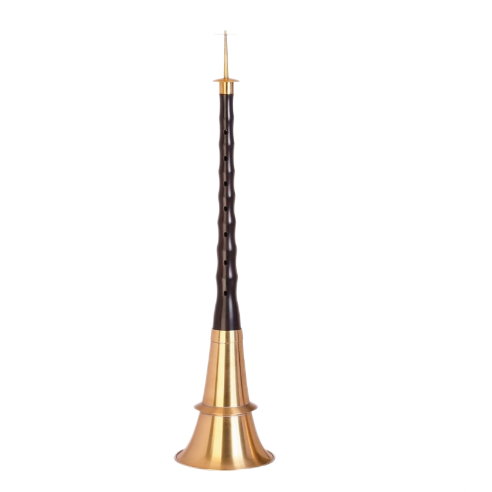
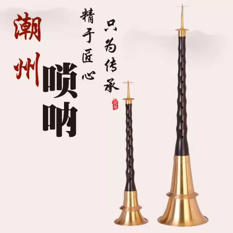
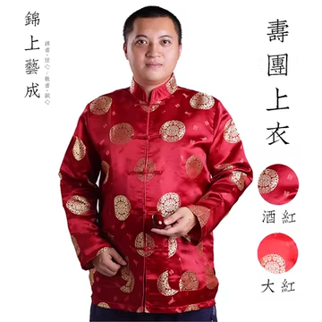
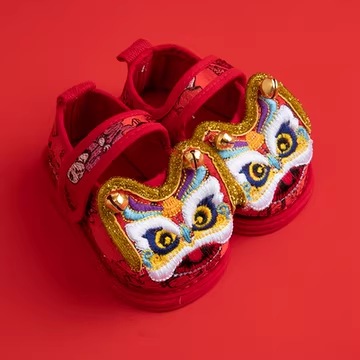
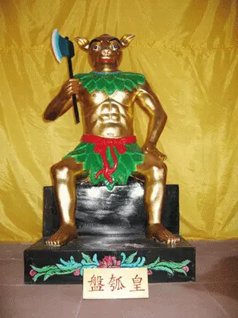
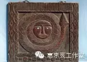
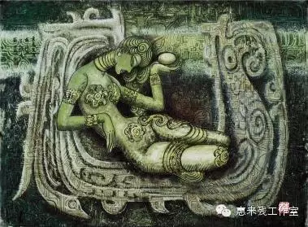

潮州唢呐

视频另附

**1.**

**潮州唢呐**，是中国广东省潮汕地区极具特色的民间吹奏乐器，属于唢呐家族的重要分支，已有数百年历史。它不仅是潮州音乐的重要组成部分，更是潮汕民俗活动不可或缺的乐器。

**外形与结构**

潮州唢呐与北方唢呐形制大致相同，通常由喇叭口、管身、哨子三部分组成，但在管身长度、孔距设计、哨片制作等方面具有地域特色。潮州唢呐的哨片较薄，音色更加柔美细腻。

**音色与风格**

潮州唢呐音色明亮、高亢，又可演奏出细腻婉转的旋律，具备极强的表现力。它擅长表现悲欢离合、喜怒哀乐等丰富的情感。演奏时讲究“吹、颤、滑、绞”等技法，富有潮州音乐特有的韵味。

**主要用途**

潮州唢呐在潮汕地区的用途非常广泛：

*   喜庆场合：婚礼、节庆、庙会
*   丧葬礼俗：为亡灵送行，演奏哀乐
*   戏曲伴奏：潮剧中常用唢呐烘托气氛
*   民间艺术：潮州大锣鼓、潮州细乐等都常用唢呐

**代表曲目**

潮州唢呐有丰富的传统曲目，如《迎宾曲》、《哭皇天》、《将军令》等，每首曲子都有其特定场合与情感表达

 

2\. 潮州话视频大意

《将进酒》

君不见，黄河之水天上来，奔流到海不复回。

君不见，高堂明镜悲白发，朝如青丝暮成雪。

人生得意须尽欢，莫使金樽空对月。

天生我材必有用，千金散尽还复来。

烹羊宰牛且为乐，会须一饮三百杯。

岑夫子，丹丘生，将进酒，杯莫停。

与君歌一曲，请君为我倾耳听。

钟鼓馔玉不足贵，但愿长醉不复醒。

古来圣贤皆寂寞，惟有饮者留其名。

陈王昔时宴平乐，斗酒十千恣欢谑。

主人何为言少钱，径须沽取对君酌。

五花马，千金裘，呼儿将出换美酒，

与尔同销万古愁。

3.潮州服装与图腾

**潮州服装**

**男性服饰**

*   **唐装、长衫**  
    传统潮州男子多穿长衫，外加马褂或唐装，色彩素雅，以黑、蓝、灰居多，显得庄重肃穆。
*   **工艺细节**  
    潮州服饰注重刺绣工艺，即便是男装，也常在领口、袖口或袋边绣上简洁的花纹，精致典雅。

**女性服饰**

*   **凤头裙褂**  
    潮州女子最具代表性的服装是“凤头裙褂”。裙褂多为红色或其他鲜艳色彩，用金银线绣出凤、花、蝶等图案，极其富丽堂皇，常用于婚礼或节庆。
*   **日常装扮**  
    日常则多穿宽袖短衫、搭配百褶长裙，色彩雅致，面料以丝、绸为主，既舒适又显秀丽。

**儿童服饰**

*   潮州儿童服饰同样讲究刺绣，常有“平安衣”、“虎头鞋”等，寓意驱邪保平安。

 

**潮州图腾**

图腾崇拜是检验初民族源的一种历史化石。它扎根于民间，载述于史书。人们可从它身上解答氏族的起源与演化。

1、盘瓠图腾崇拜

盘瓠图腾是古代潮汕最主要的一个图腾，它甚至曾经覆盖着包括今天的梅州和惠州市乃至今天广州、番禺、顺德、南雄及海南、台湾两岛等一片天地。据潮州石鼓坪村、李工坑村、文祠镇畲族的《祖图》和闽西南、浙南等畲、瑶的《过山榜》、《图牒》的大量资料表明，今潮州凤凰山就是这一部落最早的居住点。由于他们信仰盘古为“原始神”，盘瓠为“祖先神”，他们的足迹所到之处留下一路“神犬”图腾。这个以迁徙为主要特征的部落，汉晋时代有一支迁居于武陵郡(今湘西、鄂西地区)，史称“武陵蛮”，他们或有开梅山的丰绩，对中国道教的发展有着举足轻重的贡献!与此同时他们其中又有一支于汉初两次被迫向江淮一带迁徙；隋唐以后又逐步南迁并定居在广东、浙江、福建、江西等省。但无论居住在那里，他们都比较一致地说，潮州凤凰山是他们祖先的策源地。今浙南丽水市32万的畲族人民，几乎众中一声，仍然这么说。

　　这个部落开始并不叫“畲族”，畲族是南宋时人们根据他们以“刀耕火种”和“搭棚而居”的农业经济和居住形式的主要特点才这样称呼的。所以畲族是他称，不是自称。据《潮州文物志》，居住在凤凰山上的畲民，解放前夕在登记户口的表格“民族”栏上，普遍填写为“凤凰自家人”。他们只知道“耕畲”，而不知道什么叫“畲族”。但是，历史上对畲族称呼的名堂甚多，除了自称“凤凰自家人”、“山哈”(意为山里人)外，他称则有：如山越、畲人、佘民、瑶人、苗、黎、僚及白衣居士等等，尤其必须指出，在潮汕、闽西南浙南乃至赣东南一带，所谓“畲瑶”和“闽僚”、“蛮僚”、“蜒”、“苗”、“黎”的称谓，实际上都是指畲人(笔者按：严格意义上的畲族称呼，是解放后才确定的)。但无论怎么称呼，他们都是以信奉“盘瓠图腾”的那一支群落。

　　盘瓠图腾崇拜是畲族的祖先崇拜。凤凰山畲族立族的故事与干宝《搜神记》记载略有不同，因为它和古代的“海战”紧密联系在一起，故称它为“海系”畲族。故事大概是这样：高辛氏(东夷)被番王所困，国(族)中大臣难解此围，便出榜告示：能解此围者招为附马。一神犬揭榜，神犬乃东海龙王出世，出生时颇为神奇：宫中大耳婆患耳疾，三年未愈，延医诊治，从耳朵里挖出一个卵子，覆盖着瓠瓜制成的盘子，孵出的神犬取名盘瓠。盘瓠五个月便成长为五彩斑斓的雄伟身驱。以他的智谋忠勇，泗海横渡，乘番王酒醉，咬断番王首级来献，遂解此围。君无戏言，公主应纳，遂招盘瓠为驸马，公主问他能变成人吗?盘瓠说能。约五天藏于暗室作法，不可相见。至第四天，公主心急，偷窥视之，法破遂止，只好变成“犬首人身”。盘瓠和公主婚后，生下三男一女。大儿子用盘装，取姓盘；二儿子用篮提取姓蓝：三儿子打雷时生下来，取姓雷；四女儿嫁给钟家，取姓钟。从此别“帝京”，进山林，搭棚而居，耕畲而种，繁衍生殖，拓展扩族，其子孙后代，代代崇拜盘古为原始神，信仰盘瓠图腾。

　　盘瓠图腾实际上是“犬鸟合一”的图腾，因为“盘瓠是卵生，放于盘，覆于瓠，置于阁，百鸟来朝”，故曾盛行凤凰装饰。潮汕农村至今还流传着每当人家新婚时，门楣上贴“凤凰到此”的红联风俗，新妇必戴凤凰髻，枕头必绣上“花好川圆”的凤凰饰，表明“盘瓠”延继的遗痕仍存在今天的潮人当中。盘瓠图腾也可以说是最古老的农业图腾。本来瓠即瓠瓜，是一种极其古老的藤生植物，人类远古的一种粮食，浙江河姆渡文化出土据今6000多年的瓠瓜化石，近年学术界有见解认为：盘瓠崇拜必然源于远古农业发生地区；潮汕人耕田向来都有“火耨”的习惯，如收割后烧稻草以灭虫并用作基肥等等，同时，由于“盘瓠”“腹大籽多”的形象是古代生殖崇拜的象征物，因此，在畲族的总策源地——潮州凤凰山，每年除夕、春节和招兵节祭拜祖先，畲族人民采用各种丰富的图腾习俗，如大唱《高皇歌》、斗畲歌等纪念方式，来歌唱盘古开天辟地，盘瓠生男育女，显示神犬的嬗递。

2、蛇图腾崇拜

　　古代潮汕蛇图腾崇拜的现象极为普遍。潮汕几乎大大小小的村落，都有图腾神——“青龙帝君庙”的建立，至清代民间还盛行着祭祀“活图腾”的风俗，把一种被称为“活青龙”的草绿色的小蛇，盘绕在香炉的香骨(枝)上，庙祝 (巫师)口中念着咒语，小蛇在香烟缭绕中缓慢地蠕动着，吸引着无数善男信女。甚至，还有一种“蛇头龟身蛇尾”，俗称“龟蛇”的青头小山龟和一种背上长有三条金丝纹理，人称尖蜍的绿色小蟾蜍，均被列入蛇的“亲属”而加以顶礼膜拜。

　　据历史文献，粤东蛇图腾主要来源于南蛮中的两支后裔：“越”和“闽”。

　　南蛮这个大部落，原指古时候居住在长江中下游一带的人群，他们绝大部分属于“赤脾”、“黄肤”、“黑眼”的南蒙古利亚种人。王小盾教授在《原始信仰和中国古神》一书中指出：他们“在炎帝和黄帝时代称作‘九黎’，在尧舜时代称作‘三苗’，在商周时代称作‘南蛮’，无论他们被如何称谓，他们都是蛇图腾的主要崇拜者。在夏禹征伐三苗时代，南蛮中的一支后裔——“闽”，便和三苗的东支结成部落联盟，进入粤东和福建大地后。又和从南海诸岛上迁来的一支人群，即后来被称作“畲”的部落融合，逐步演化为粤东和福建的土著“蛮僚”：南蛮的另一支后裔——“越”也于此同时兴盛，至战国时演变成为“百越”，并定居于云贵、江浙、福建和两广一带。潮汕地处广东的东部，毗邻福建的南部，三面环山，一面临海，正是“闽”“越”最好的交汇融合处，这就是古代蛇图腾崇拜的主要覆盖区之一。

　　《说文解字》是我国第一部具有训诂文化价值的权威字典，它对“蛮”和“闽”的解释便以图腾为依据。对“蛮”解释说：“南蛮，它(蛇)种，从虫蛮声。”对“闽”字解释说：“东南越，它(蛇)种，从虫、门声”。据此，王小盾、王纯声教授均引用《国语·郑语》之记载，进一步考证了“闽”“芈”、“蛮”是由一个“蛮”字分出来的三个字。尤其有趣的是，“芈”原来是融八姓之末姓，夏禹姓“巳”(姒)，是八姓中之首姓。这样一来，“蛮与三苗”、“蛮与闽”、“蛮与越”和“蛮与楚”，其族源都与夏氏族有着千丝万缕之承传关系。据考，他们这一部落到了百越的时代，都自称“龙种”(蛇种)、“龙户”，断发文身奉祭“青龙庙”，并流传着“僚妇化蛇”和“飞头僚食恶人屎”的图腾神话，认为蛇是“真善美”的化身，蛇可以变化美女；还确信蛇是龙的原型，龙是蛇的神性的显示。《左传哀公七年》、《庄子·逍遥游》、《史记·吴太伯世家》、《越世家》等史籍，都记载着他们留下的风俗。

3、鸟图腾崇拜

　　鸟图腾是古代东夷族信奉的图腾。其覆盖面十分广阔，从辽东半岛至南海，几乎中国全部的海岸线地区，都是东夷部族先后活动的范围；由于秦、赵和徐人均系同源于东夷的赢姓，所以在公元前七世纪以后，鸟图腾不断向内陆地区延伸；另—方面，古越族的后裔百越、百濮部分族群活动过的地区，也留下了一路鸟图腾的遗痕。

　　古代潮汕鸟图腾的来源主要有二：一是如上所述，在远古的时代，畲人参加东夷高辛部族联盟，在一次海战中盘瓠立了大功，获得与高辛部族通婚的机会，因此，东夷部族和畲人、番人一起进入了粤东、闽西南、浙南乃至赣东南：一是在禹征伐三苗的时代，古越族进入东南地区，演变成百越、百濮中的“雒民”那一支系，从广西、安南水陆兼并，把鸟图腾带进粤东。

　　卵生神话体现了鸟图腾的原始性。在粤东，有两个神话为人们所津津乐道，代代相传。一是《玄鸟生商》：传说远古时代，有一位漂亮的姑娘，在纺纱织布时，突然，天上飞来了一对燕子，燕子和姑娘十分亲昵，站到她的肩上就不再飞走。姑娘好奇地把燕子养进了笼里。燕子下了蛋，姑娘把蛋子吃了，就怀孕了，生下孩子来，这孩子长大成为商朝的第一任君主。至今，潮汕人做生日，仍然忘不了这一神圣的图腾仪式，即第一道菜必定食“粉丝煮鸡蛋”，以示长寿兴旺。尤其有趣的是，潮汕人特别热爱燕子，欢迎燕子到家里的客厅上筑巢，叫“厅上燕”、或“梁上燕”，奉为“座上客”。人们还经常用红纸做成精美的袋子，贴糊在燕巢下，一是保护乳燕的安全；二是作为明年飞来燕子的识别物，象征家运永昌。

　　一是《朱蒙的传说》。朱蒙是夫余国的先祖，夫余国则是高句丽(朝鲜)的前身。传说有一天，天上飞来了一团象鸡蛋一般大小的气体，这团气体飞进一位女人的身体内，这女人就产了一个卵子，卵子孵出了朱蒙。这类图腾神话后来演变成满族《三仙女传说》，再演变成为清朝的始祖说。很多清史典籍都这样记载：天女佛库伦曾在长白山下池中洗浴，吃了神鹊衔来的朱果，遂生下爱新觉罗·布库里雍顺。他便是后来的清始祖。

　　上述图腾神话可以表明，“玄鸟生商”和“朱鹊生清”均同源与东夷部族，并在东夷部族南下中原之前便形成的。王国维研究“红山文化”认为，商朝是在一片卵生文化的基础上建立起来的，这结论是完全正确的。至于上面提到的，由百越、百濮部族的后裔带进粤东地区鸟图腾，那却是源于古越族的“雒子”图腾。“雒子”即罗平鸟(鸽子)，本是吴越地区的罗平鸟崇拜，随着古越族向广西、安南的迁徙与演化而带进了古粤东。他们盛行了一种神杆，神杆上刻着鸟形象，在节日，全族人围着竖起的神杆载歌载舞，男人头上插鸟羽，女人头上戴凤冠，欢天喜地地跳个通宵达旦。这种图腾仪式，直至清未民初，已演变成为潮汕民间“娶新娘”的礼仪，今天潮汕的旗杆，旗杆夹实际上也是“罗平鸟”神杆的演变，等等。但由于古代潮汕地处东南僻隅，民族融合相对缓慢，这里，除了上面介绍的具有比较鲜明的文化特征和丰富的习俗表现的三大图腾外，还保留着更加古老的图腾残迹，如今揭西三山神庙的“前有枫树、后有石穴”之枫树崇拜：澄海建阳村每年农历六月十五日，全村祭拜一株古老的榕树之榕树崇拜；今揭阳城称榕城，潮阳城称棉城等等。此外，还有水族的“鱼虾蟹”的崇拜，彝族的“葫芦”崇拜，土家族的青蛙崇拜……等等，只是由于年代久远，遂渐渐被淹没罢了。