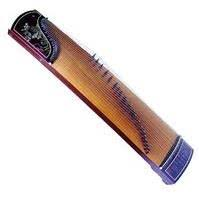
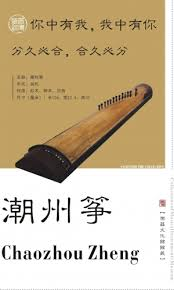

潮州筝

1.

**一、历史渊源**

**潮州筝，源自中国古筝体系，流行于广东潮汕地区，距今已有数百年历史。**

*   **起源：古筝最早可追溯至秦汉时期，传入岭南后逐渐融入当地民间音乐。**
*   **发展：潮汕民间乐师将古筝结合潮州音乐的节奏、旋律与装饰技巧，形成独具地方特色的潮州筝艺术。**
*   **鼎盛时期：清代中后期到民国初年，潮州筝广泛活跃于潮剧、弦诗乐、大锣鼓及各类民间音乐场合。**

**潮州筝的形成与潮汕地区繁荣的民间音乐环境密不可分，是潮州音乐的重要代表。**

**二、外形与构造**

**潮州筝与北方古筝虽外形相近，但在制作、用材、结构和音色方面皆有独特之处：**

**1\. 材料**

*   **面板：选用质地坚韧、音质佳的桐木或杉木**
*   **底板：多为坚硬木材，如梓木、楠木**
*   **弦：**
    *   **传统：丝弦，声音柔和细腻**
    *   **现代：钢丝或尼龙包钢丝弦，音色明亮，音量更大**

**2\. 筝体尺寸**

*   **潮州筝长度一般在 160-170 厘米**
*   **筝体较窄，略弯曲**
*   **筝柱（马子）较高，弦距稍宽**

**3\. 筝马**

*   **高度较北方筝更高**
*   **常用花梨木、紫檀木制作**
*   **有助于音色更具穿透力**

**4\. 外观装饰**

**潮州筝常以漆绘、雕花、镶嵌贝壳、彩绘等工艺装饰，具有强烈的地方艺术风格。**

**三、演奏技法**

**潮州筝技法丰富多彩，与北方筝有显著差别，尤其注重细腻的装饰音与复杂的节奏变化。**

**1\. 右手技法**

*   **勾、抹、托：基础弹奏法**
*   **滚：潮州筝代表性技法，快速往返弹奏同一音，产生持续颤动效果**
*   **撮（撮音）：拇指与食指快速弹奏两个或多个音**
*   **挑、打：增强节奏感**
*   **颤指：轻巧、细腻，表现情感波动**

**2\. 左手技法**

*   **按弦：左手按弦改变音高，制造滑音效果**
*   **吟、揉：微幅上下移动产生波动音色**
*   **绞弦：快速上下拉动弦，制造“哭腔”效果，是潮乐独特技法**

**3\. 节奏特点**

*   **节奏多变，擅长使用急缓对比**
*   **“散、慢、中、快”多层次速度处理，表现潮乐灵动多变的风格**

**四、音色与风格**

**潮州筝音色有以下特点：**

*   **清脆透亮**
*   **颗粒感强**
*   **装饰音丰富**
*   **擅长表现潮汕音乐特有的喜庆、悲凉、热烈、细腻等多种情感**

**与北方古筝的悠远宽广相比，潮州筝更显紧凑、华丽、技巧性强。**

**五、潮州筝曲目**

**潮州筝曲多从潮州弦诗乐、潮剧音乐、民间小调衍化而来，曲目繁多且风格各异。**

**代表性曲目**

**《寒鸦戏水》**

*   **最具代表性的潮州筝曲**
*   **模拟寒鸦在水面嬉戏的情景**
*   **技法：滚奏、绞弦、快速滑音**

**《柳青娘》**

*   **旋律婉转哀怨**
*   **常用于表达离愁别绪**

**《汉宫秋月》**

*   **古曲移植潮州筝演奏**
*   **音色空灵，富古韵**

**《八骏马》**

*   **节奏明快**
*   **模拟马蹄声，充满动感**

**《出水莲》**

*   **描绘莲花出水的秀丽姿态**
*   **富有装饰音和细腻变化**

**六、文化价值**

**潮州筝不仅是一种乐器，更是潮汕文化的重要组成部分：**

*   **潮剧伴奏：潮剧离不开筝乐，筝声营造戏曲的悲喜氛围**
*   **潮州弦诗乐：筝在合奏中起着主旋律或伴奏的作用**
*   **民俗活动：婚礼、节庆常有筝乐表演**
*   **艺术传承：潮州筝已被列入非物质文化遗产，成为潮汕文化的重要符号**

**许多潮州筝演奏家不仅在本地传承技艺，也活跃于国内外演出，推动潮州筝走向世界。**

 

2.视频大意

**《水调歌头·明月几时有》**

**宋·苏轼**

明月几时有？把酒问青天。  
不知天上宫阙，今夕是何年。  
我欲乘风归去，唯恐琼楼玉宇，高处不胜寒。  
起舞弄清影，何似在人间？

转朱阁，低绮户，照无眠。  
不应有恨，何事长向别时圆？  
人有悲欢离合，月有阴晴圆缺，此事古难全。  
但愿人长久，千里共婵娟。