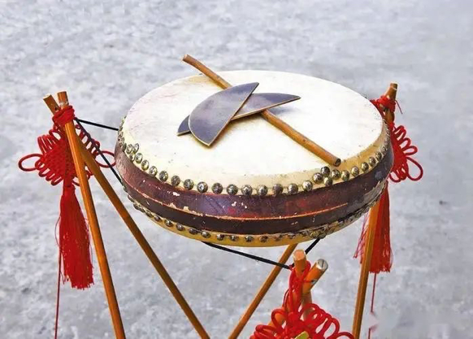
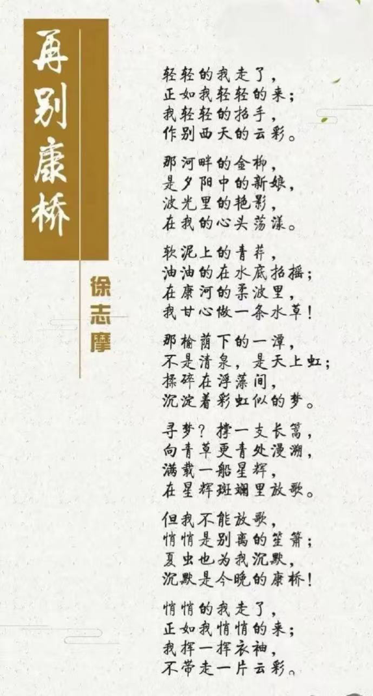
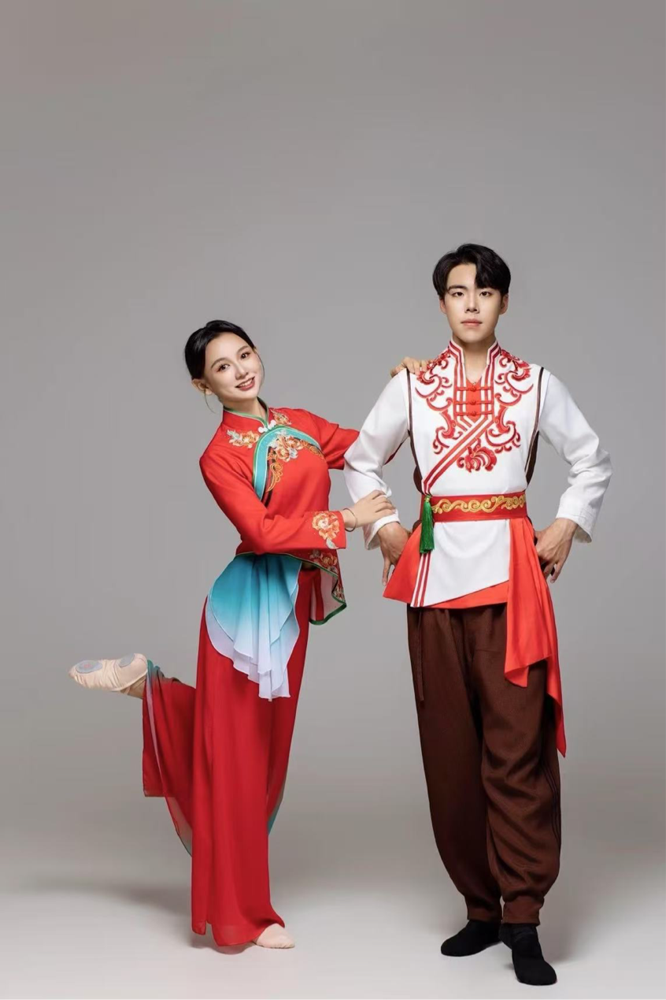

汉族（东北）｜东北大鼓

1·东北大鼓

东北大鼓起源于中国东北地区，其历史可以追溯至清代，历经200多年的艺术沉淀，最初是由当地农民在农闲时为了自娱自乐而创作的一种民间艺术形式，它融合了歌唱、说书、击鼓等多种艺术手段，在吸收了东北民歌、东北小调的基础上，演化而成一种新的艺术形式，形成独树一帜的艺术风格，更成为一个不可忽视的文化标志。

东北大鼓的表演形式通常由一位或多位演员承担，以书鼓、木板、三弦为主要乐器，辅以铜板、竹板、醒木等打击乐，边敲击边说唱，声音激昂或低回，配合丰富的肢体语言和表情，使得整场表演既富有戏剧性又充满节奏感。

2·视频歌词大意

3·东北民族服饰

东北服饰以实用保暖为核心，融合多民族文化与地域特色，形成了兼具功能性、装饰性和文化内涵的独特风格。‌ 其特点主要体现在传统服饰的皮毛运用、抗寒设计、民族刺绣以及现代创新融合等方面。

