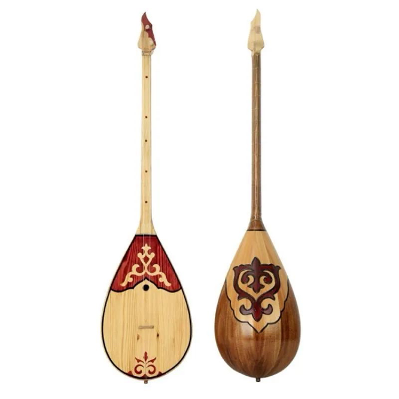
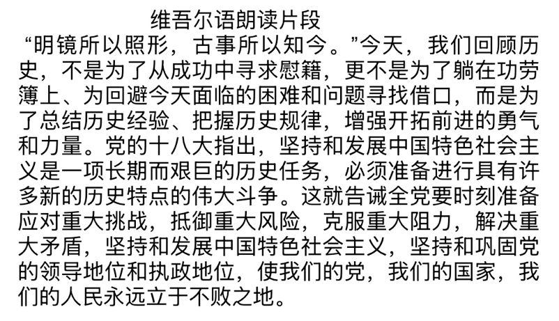
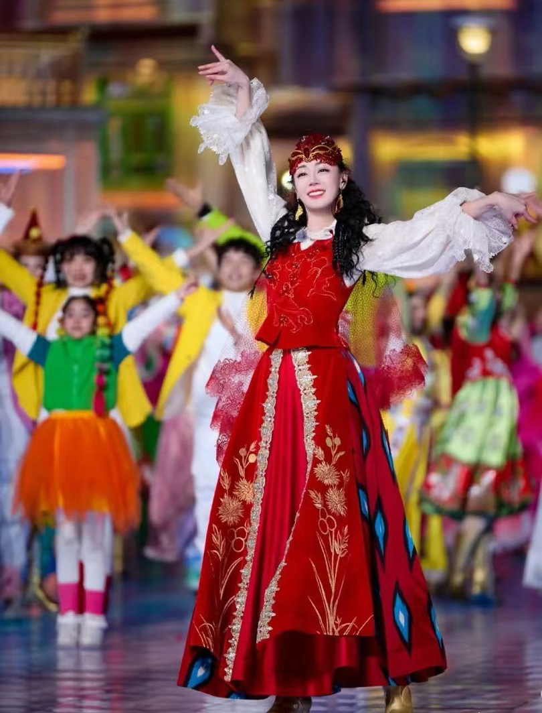

维吾尔族（新疆）｜ 冬不拉

\*视频另附

1 · 冬不拉

冬不拉是一种弹拨弦鸣乐器，其形制多样，但基本结构相似。常见的冬不拉多为木制，呈长柄梨形，琴身中央部分略宽，两侧逐渐收缩为细长的颈部。琴面多采用松木或杏木等硬质木材制作，并蒙以羊皮、马皮或蛇皮等动物皮革作为共鸣膜。琴颈上设有品丝或品位，用于确定音高；同时，琴颈顶端装有木质或骨雕的琴头，既美观又实用。冬不拉的琴弦一般为两根或三根，由金属丝或羊肠线制成，通过琴马（即弦枕）固定在共鸣膜上。

2 · 方言视频大意

3 · 民族服饰

维吾尔族服饰——花样较多，非常优美，富有特色。 维吾尔族男性——讲究黑白效果，这样粗犷奔放。 维吾尔族妇女——喜用对比色彩，使红得更亮，绿得更翠。 维吾尔族是个爱花的民族，人们戴的是绣花帽，着的是绣花衣，穿的是 绣花鞋，扎的是绣花巾，背的是绣花袋，衣着服饰无不与鲜花息息相关。