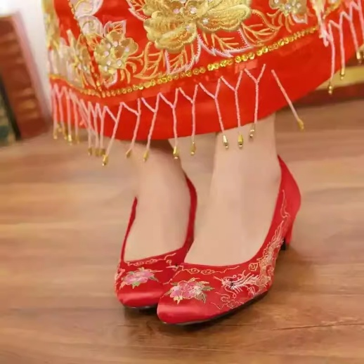
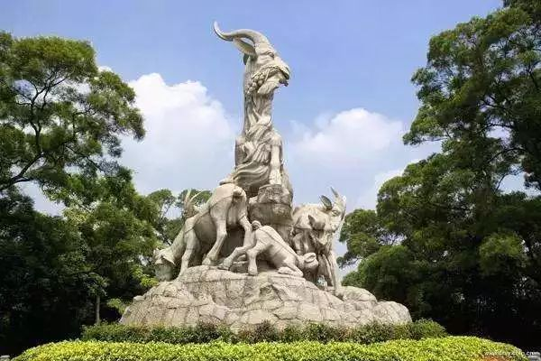

岭南（广州）| 洞箫

1.

**洞箫**，简称“箫”，是中国传统的竹制管乐器，属于边棱气鸣乐器。它因底部开口，称为“洞箫”，以区别古代一种管尾封闭的“闭口箫”。

*   洞箫：管底开口
*   闭口箫：管底封闭

**外形与构造**

洞箫的制作十分讲究，工艺精细，外形优雅。

**1\. 材料**

*   主要以竹子为材：
    *   紫竹：声音醇厚
    *   黄竹：音色明亮
    *   老竹：音质更稳
*   高档箫常选用生长期长、竹节疏密适中的竹子。

**长度与孔数**

*   一般长度：60cm ~ 90cm
*   最常见：八孔箫（现代最常用）
*   古制：六孔箫（古箫多为六孔）

**结构组成**

*   吹口：斜吹口（U形或V形斜口），气流击打管壁发音
*   管身：中空竹管，有六或八个按音孔
*   尾端：开口，称为“洞”，产生低沉回响
*   内径：比笛子略小

**装饰**

*   高档箫常饰以刻字、雕花、镶嵌螺钿或漆绘
*   部分箫体刻有古诗文

**发音原理**

洞箫属于**边棱气鸣乐器**。

*   演奏者将气息吹向箫口的斜切边缘，气流分裂后，在管内形成振动，产生音响。
*   管内空气柱的长度决定音高，按孔控制音阶。

**音色与风格**

洞箫是中国传统乐器中最具“文人气”的乐器之一。

**音色特点**

*   空灵幽远
*   柔美细腻
*   哀婉凄清或宁静高远
*   富于韵味与诗意

洞箫善于表现：

*   孤寂、哀愁
*   幽深、空灵
*   超凡脱俗的意境

古人赞箫为：

“箫声一发，泪下如雨。”

**演奏技法**

洞箫技法极其丰富，是它艺术魅力的重要来源。

**1\. 气息运用**

*   箫乐重气息控制
*   强调弱起、渐弱、虚实结合

**2\. 装饰音**

*   倚音
*   滑音
*   花舌
*   吞音

**3\. 特殊技法**

*   吐音：短促快速的分音
*   颤音：持续细颤
*   响音：爆发力强
*   “花舌”：舌快速颤动，制造颤音效果
*   内滑音：左手指在孔上轻移

**流派与风格差异**

中国不同地区有不同箫派，风格各异。

**1\. 江南派**

*   声音清丽、细腻
*   演奏《平沙落雁》《梅花三弄》极具特色

**2\. 蜀派（四川）**

*   音色浑厚、苍凉
*   善用滑音和吟音

**3\. 北方派**

*   吐音、颤音更强烈
*   音量较大

**曲目代表**

洞箫有大量经典曲目：

*   《平沙落雁》：描绘落雁江湖、秋水共长天一色
*   《梅花三弄》：模仿梅花傲雪开放
*   《幽兰》：清淡古雅
*   《塞上曲》：苍凉辽阔
*   《春江花月夜》：古筝或箫名曲
*   《潇湘水云》：表现潇湘水乡之幽美

2.其他地区的发展

**地区**

**音色特点**

**风格**

**广州（岭南）**

清润、细腻、轻柔

偏文雅，讲究韵味

**江南**

清丽、婉转

文人气息浓厚，丝竹风格

**北方**

雄浑、苍凉

音量大，适合辽阔场景

**四川（蜀派）**

浑厚、沉稳

富西南风情，擅长滑音

3.广州方言视频大意

**《定风波》**

（苏轼）

三月七日，沙湖道中遇雨。雨具先去，同行皆狼狈，予独不觉，已而遂晴，故作此词。

莫听穿林打叶声，何妨吟啸且徐行。  
竹杖芒鞋轻胜马，谁怕？一蓑烟雨任平生。

料峭春风吹酒醒，微冷，山头斜照却相迎。  
回首向来萧瑟处，归去，也无风雨也无晴。

4.广州特色服装与图腾

**一、广州特色服装**

广州作为南国商都，历史上商贾云集，中外文化交融，服装风格多样，既保留传统，又体现现代都市时尚。

**（一）女性服饰**

**1\. 广式旗袍**

*   广州是中国旗袍流行重镇。
*   **风格特点**：
    *   剪裁贴身，线条流畅
    *   喜用轻薄、凉爽的丝绸、雪纺
    *   图案常见花鸟、凤凰、牡丹等岭南吉祥元素
*   广州女性在婚礼、宴会、节庆常穿旗袍，尤其在中秋、春节走亲访友时。

**2\. 丝绸衫裤**

*   传统广州女性夏装
*   面料轻薄，适合湿热气候
*   常见颜色：
    *   天蓝
    *   粉红
    *   米白
*   在老广家族中，长辈仍喜穿丝绸上衣搭配阔腿长裤。

**3\. 婚礼凤冠霞帔**

*   广州传统婚礼依旧保留凤冠霞帔。
*   **特色**：
    *   红色为主
    *   刺绣龙凤、牡丹、喜鹊
    *   金线、银线华丽精致
*   广州婚礼还常有“裙褂”（又称“龙凤褂”）：
    *   以红色为底
    *   龙凤纹样金线绣满
    *   华丽而庄重

**（二）男性服饰**

**1\. 唐装**

*   广州男性节庆、聚会常穿唐装。
*   **特点**：
    *   立领、盘扣
    *   多用绸缎、麻布
    *   色彩偏深红、深蓝、灰黑

**2\. 黑布衫、宽裤头**

*   老一辈广州男性常穿
*   多用于日常生活、拜神、庙会
*   色彩多以深色系为主

**（三）特色配饰**

广州女性传统配饰丰富：

*   银饰发簪
*   绣花鞋
*   银链手镯
*   金箔花（婚礼常见）

**二、广州特色图腾**

广州作为岭南文化核心地，图腾符号与本土风俗紧密相连，既承载历史，也表达对吉祥、平安、兴旺的美好祈愿。

**（一）五羊**

*   广州别名“羊城”
*   源自“五羊传说”：
    *   五仙骑羊下凡，赠五谷，祝广州风调雨顺
*   **五羊形象**：
    *   市徽
    *   城市雕塑（如越秀公园五羊雕像）
    *   城市标志物

羊成为广州最具代表性的城市图腾。

**（二）龙凤**

*   广州刺绣、婚礼服、宗祠雕刻常见
*   **象征**：
    *   龙：权威、尊贵、家族兴旺
    *   凤：和谐美满、婚姻幸福

**（三）牡丹**

*   在广州服饰、建筑、刺绣中频繁出现
*   寓意富贵、繁荣

**（四）狮子**

*   广州是南狮（醒狮）的发源地之一
*   狮子图腾用于：
    *   庙宇灰塑
    *   宗祠门楼
    *   节庆舞狮
*   象征驱邪避凶、镇宅平安

**（五）凤凰**

*   广州刺绣、旗袍、婚服常用
*   寓意祥瑞、尊贵

**（六）花卉图腾**

*   广州别称“花城”
*   常见花卉图腾：
    *   木棉（市花）
    *   荷花
    *   桃花
*   广州服饰、年画、建筑灰塑常用花卉图案，象征春意、繁荣、生机。

