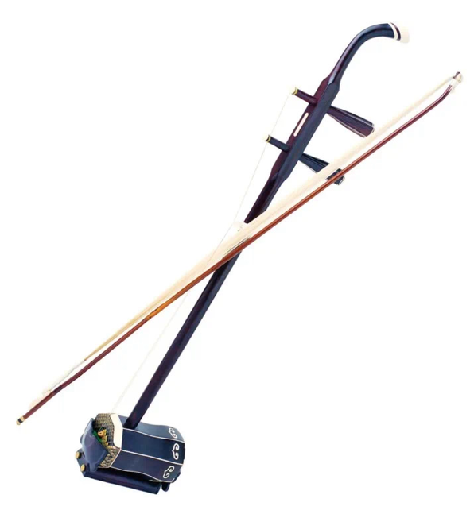
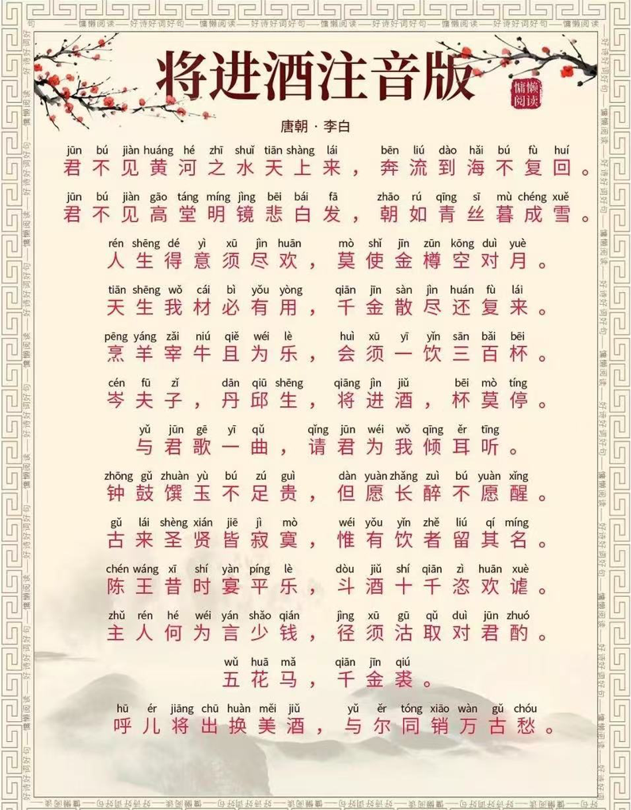
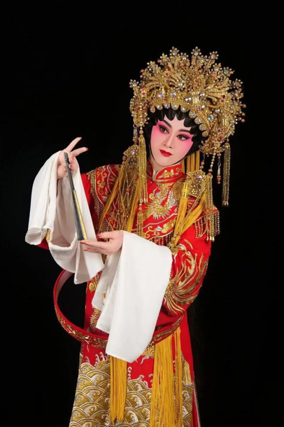
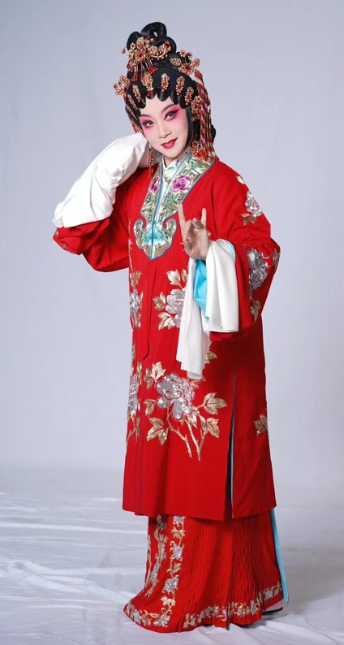

汉族（广东）｜高胡

1· 高胡

高胡是高音拉弦乐器，乐队中高胡按实际音高记谱，定弦比二胡高纯五度或纯四度。三只小熊·1发音紧张、尖锐，不宜多用。在常用音域范围，其音色明朗、清澈，适宜演奏优美、抒情以及秀丽、活泼的曲调，并经常与二胡构成八度奏。高胡是"高音二胡"的统称，是在二胡的基础上改制而成的。高胡的产生，和中国民间乐种广东音乐有着密切的联系。也同广东地区的粤剧有密切联系，曾作为粤剧伴奏的主奏乐器，因此，高胡也常被称为“粤胡”。"广东音乐"是流行在中国广东地区的一种民间器乐表演形式，它起源于当地的地方戏剧和民间音乐。二十世纪二十年代以前广东音乐中并没有高胡这种乐器，在二十世纪二十年代前后，"广东音乐"作曲家和演奏家吕文成先生对二胡进行了大胆的改革，他把传统二胡的丝弦改为钢丝弦，提高了定弦，并用两腿夹着琴筒进行演奏，这种音色清澈明亮的高音二胡，就被人们称作高胡，并且很快成为"广东音乐"中的灵魂乐器。

2·方言视频大意

3·粤剧服饰

汉服中的粤剧服装是粤剧艺术的重要组成部分，融合了广绣技艺与岭南文化特色，以华丽精美、色彩鲜艳、装饰性强著称，通过服饰样式、色彩和图案区分角色身份与性格。

‌