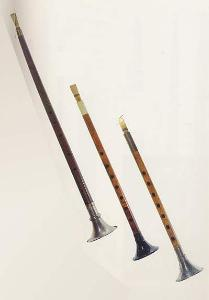

**岭南|喉管**

**一、喉管在潮汕的地位**

**（1）属于潮州乐器体系**

*   **喉管是潮州音乐中非常重要的乐器：**
    *   **潮州弦诗乐**
    *   **潮州大锣鼓**
    *   **潮剧（潮州戏曲）**
    *   **民间礼俗（婚丧喜庆）**

**（2）用途极其广泛**

**潮汕地区的喉管用途：**

*   **潮州弦诗乐中担当主旋律乐器**
*   **潮剧舞台上营造悲、喜、紧张等氛围**
*   **婚礼吹奏喜庆曲**
*   **丧事吹奏哀乐**
*   **庙会、游神活动吹奏仪仗曲**

**在潮州音乐里，若没有喉管，便少了最具地方色彩的那股韵味。**

**二、潮汕喉管的特色**

**（1）外形与构造**

*   **外形类似唢呐**
*   **管体多用木制**
*   **喉管的哨片（簧片）薄而灵敏**
*   **喇叭口较小，多为铜制或木制**
*   **长度比北方唢呐稍短**

**（2）音色**

**潮州喉管音色非常有特色：**

*   **高亢而不刺耳**
*   **嘹亮、通透**
*   **带有一种独特的潮韵**
*   **善于表现悲、喜、紧张、舒缓等多种情感**

**这与北方唢呐那种粗犷、激昂的音色有明显区别。**

**（3）演奏技法**

**潮汕喉管的演奏技法独树一帜：**

*   **滑音**
*   **绞音**
*   **哭音**
*   **快速花舌**
*   **连音**

**尤其是“绞音”与“哭音”，是潮剧、潮乐中表达悲怆情绪的重要技法。**

**三、岭南其他地区是否有喉管？**

**在岭南：**

*   **喉管主要集中在潮汕地区使用。**
*   **广州、佛山、江门等地主要使用：**
    *   **唢呐**
    *   **笛子**
    *   **萧**
*   **粤剧音乐里也会用唢呐，但不称“喉管”，音色和吹奏技法也不同。**
*   **粤西、粤北地区没有明显使用喉管的传统。**

**因此：  
喉管是潮汕地区独具代表性的岭南乐器，不属于整个岭南普遍使用的乐器。**

**四、喉管与潮汕文化的联系**

**喉管不仅仅是乐器，更是潮汕文化的重要符号：**

*   **体现潮汕人情感丰富、喜悲分明的性格**
*   **在潮汕的婚丧仪式中几乎不可或缺**
*   **是潮剧音乐的灵魂乐器**

**总结**

**喉管是岭南地区潮汕（特别是潮州、汕头）最具地方特色的乐器。**

**它不仅是潮州音乐体系的灵魂乐器，更承载了潮汕人民的生活与情感，是潮汕文化的重要象征。**

**想更深入哪部分呢？比如：**

*   **喉管在潮剧中的具体曲目？**
*   **喉管的制作工艺？**
*   **或是喉管与唢呐的区别？**

**您说：**

**请给我关于汕头喉管乐器的介绍，并附带与其他地区喉管的差异**

**ChatGPT 说：**

**非常好！你问得非常精准，咱们就聚焦到你提出的核心问题：汕头喉管乐器介绍，以及它与其他地区喉管的差异。**

**下面是一篇系统、详细又易懂的介绍，专门针对 汕头喉管：**

**汕头喉管乐器详解**

**一、汕头喉管概述**

**喉管是汕头（潮汕地区）极具代表性的民族吹管乐器，属于潮州音乐体系的重要组成部分。**

*   **地区归属：汕头及整个潮汕地区（包括潮州、揭阳）**
*   **乐器类别：双簧气鸣乐器**
*   **主要用途：**
    *   **潮州弦诗乐**
    *   **潮剧伴奏**
    *   **民间庆典（婚礼、庙会）**
    *   **丧葬仪式（吹奏哀乐）**

**二、汕头喉管的构造**

**汕头喉管的形制具有鲜明的地方特色，与北方唢呐或其他地区的喉管有所不同。**

**（1）外形**

*   **外形与唢呐相似：**
    *   **细长的木质管体**
    *   **喇叭口较小、呈圆形或八角形**
*   **管体比北方唢呐略短**
*   **部分汕头喉管管体刻有简单花纹**

**（2）簧片（哨子）**

*   **汕头喉管簧片特别薄、灵敏**
*   **簧舌宽度较窄，声音尖细而不刺耳**
*   **簧片的材质通常选用高质量芦苇或黄铜片**

**（3）喇叭口**

*   **常用铜制或木制**
*   **汕头喉管的喇叭口比北方唢呐小，发声更集中**

**三、汕头喉管的音色特色**

**汕头喉管的音色是潮乐风格的重要标志：**

*   **音色明亮通透**
*   **高音区嘹亮，穿透力极强**
*   **中低音区温柔带泣**
*   **善于表达多变的情感：**
    *   **悲怆（哭音）**
    *   **热烈（喜庆曲）**
    *   **悠远（弦诗乐）**

**汕头喉管在潮剧伴奏里尤其擅长表达细腻的情感波动，这种情感性是潮乐最打动人心的部分。**

**四、汕头喉管的演奏技法**

**汕头喉管技法非常丰富，极具地方特色：**

**（1）滑音**

*   **喉管演奏中最重要的技巧**
*   **在潮乐里称“绞音”**
*   **能产生凄美、哀怨的哭腔效果**

**（2）哭音**

*   **是潮剧或丧事音乐中必用技法**
*   **用气息和嘴唇微调产生“哽咽”效果**

**（3）颤音**

*   **运用快速手指振动或舌颤**
*   **制造旋律的灵活度**

**（4）吐音、点音**

*   **制造节奏感或模仿语音**

**五、汕头喉管的用途**

**汕头喉管用途极广：**

*   **潮州弦诗乐**
    *   **担任主旋律**
    *   **与二弦、三弦、扬琴、潮州筝合奏**
*   **潮剧伴奏**
    *   **在潮剧里是最具情感表达力的乐器**
    *   **用于表现悲剧、喜剧、紧张场面**
*   **民俗活动**
    *   **婚礼吹《迎宾曲》**
    *   **庙会、游神活动用喉管营造热闹氛围**
    *   **丧事吹《哭皇天》**

**六、文化价值**

**喉管不仅是汕头潮汕音乐的灵魂，更是潮汕文化的重要象征：**

*   **是潮剧中最具感染力的乐器**
*   **是潮州弦诗乐里不可或缺的主角**
*   **承载潮汕人对悲喜离合、人生百态的细腻表达**

**潮汕地区的婚丧嫁娶、庙会祭祀，都少不了喉管的声音。**

**七．代表作品**

**① 《平沙落雁》**

*   **潮州弦诗乐最著名的曲目之一**
*   **喉管以悠长、婉转的音色演绎，极具韵味**
*   **表现江南秋景、孤高意境**

**② 《梅花三弄》**

*   **古曲名作**
*   **喉管演奏善用滑音、颤音**
*   **表现梅花傲雪的高洁**

**③ 《八骏马》**

*   **节奏较快**
*   **模拟骏马奔驰场景**
*   **喜庆、热烈**

**④ 《将军令》**

*   **常用于喜庆、庙会场合**
*   **节奏激昂**
*   **是潮乐中最常演奏的曲目之一**

**⑤ 《南北曲》**

*   **表现南北两地曲风融合**
*   **喉管音色富层次**

**⑥ 《哭皇天》**

*   **潮汕丧礼必奏曲**
*   **喉管以哭音、滑音表达悲恸情感**
*   **是潮汕喉管技艺最高难度的曲目之一**

****

**2.与其他地区喉管的差异**

**汕头喉管与北方唢呐、以及其他地区喉管有明显区别。**

**特征**

**汕头喉管**

**北方唢呐**

**广东其他地区喉管/唢呐**

**音色**

**明亮、细腻、善于表现哀怨情感**

**粗犷、高亢、爆发力强**

**粤剧用唢呐偏明亮，但缺潮韵**

**簧片**

**较薄、灵敏，易做哭音**

**较宽厚，爆发力强**

**粤剧用簧片稍厚，音色更圆**

**喇叭口**

**小而集中**

**大而宽阔**

**多与北方唢呐接近**

**演奏技法**

**滑音、哭音极丰富**

**吹奏力度大，较少哭音**

**粤剧用唢呐技巧相对简洁**

**文化背景**

**潮州弦诗乐、潮剧、民俗**

**北方吹打乐、丧葬、庆典**

**粤剧、岭南民俗音乐**

**① 与北方唢呐的差异**

*   **北方唢呐声音粗犷有力，更适合辽阔场景。**
*   **汕头喉管更细腻，更注重情感波动。**

**② 与粤剧唢呐的差异**

*   **粤剧用唢呐音色也偏亮，但技巧没有潮乐喉管那么丰富。**
*   **潮州喉管更讲究细微的音色变化，是潮乐中最具表现力的乐器。**

**七、文化价值**

**喉管不仅是汕头潮汕音乐的灵魂，更是潮汕文化的重要象征：**

*   **是潮剧中最具感染力的乐器**
*   **是潮州弦诗乐里不可或缺的主角**
*   **承载潮汕人对悲喜离合、人生百态的细腻表达**

**潮汕地区的婚丧嫁娶、庙会祭祀，都少不了喉管的声音。**

3.汕头方言视频大意

4.汕头的民族服装与图腾

**一、汕头特色服装**

汕头是潮汕文化的重镇，服装风格深受潮汕传统、闽南文化与岭南气候影响，同时也带有侨乡文化的融合特点。

**（一）女性服饰**

**1\. 潮汕大裳（潮绣衣裙）**

*   潮汕妇女传统盛装，尤用于婚礼、节庆。
*   特点：
    *   **大红或深红**为主色
    *   上衣称“褂”，多为短款对襟，刺绣繁密
    *   下身是宽大的长裙，称为“裙”，层叠华丽
*   装饰：
    *   绣有凤凰、牡丹、龙凤呈祥等吉祥图案
    *   常用金银线、亮片、珠片精工绣制
*   潮汕大裳不仅是服装，也是潮绣艺术的载体。

**2\. 龙凤褂**

*   汕头传统婚礼必备。
*   特点：
    *   红底金绣
    *   龙凤图案布满全身
    *   金线、银线极为华丽
*   龙凤褂寓意：
    *   龙凤呈祥
    *   百年好合
*   龙凤褂在汕头被视作嫁妆中最贵重之物。

**3\. 彩绣头巾**

*   潮汕妇女的传统头饰。
*   用红色或粉色丝绸制成，刺绣细腻
*   婚礼、节庆常佩戴，显出女性温婉之美

**4\. 银饰与金箔花**

*   汕头女性传统配饰：
    *   银链
    *   银发簪
    *   金箔花（婚礼时佩戴于头顶）
*   金箔花以金片剪成花形，象征富贵吉祥。

**（二）男性服饰**

**1\. 黑布衫、宽脚裤**

*   汕头老一辈男性常穿
*   适合潮汕湿热气候，简单耐穿
*   常用于日常生活、庙会、宗祠祭典

**2\. 唐装**

*   汕头男性节庆或迎亲场合常穿唐装
*   特点：
    *   立领
    *   盘扣
    *   多为深色绸缎

**二、汕头特色图腾**

汕头的图腾与潮汕文化密不可分，既充满地方特色，又承载文化信仰。

**（一）凤凰**

*   在潮汕刺绣、婚礼服、庙宇雕刻里非常常见。
*   寓意：
    *   高洁
    *   吉祥
    *   婚姻美满

潮汕大裳、龙凤褂上一定有凤凰图案。

**（二）牡丹**

*   潮汕刺绣和家具雕刻常见
*   寓意：
    *   富贵
    *   繁荣
    *   幸福

在婚礼服、绣品上尤多。

**（三）龙**

*   在潮汕建筑、服装刺绣、庙宇装饰中广泛使用
*   象征：
    *   权威
    *   兴旺
    *   尊贵

潮汕人对龙尤为崇敬，许多潮绣作品均以龙为主题。

**（四）狮子**

*   潮汕是南狮（醒狮）的发源地之一
*   狮子图腾用于：
    *   庙宇灰塑
    *   家族宗祠门楼
    *   节庆舞狮场景
*   象征驱邪避凶、平安吉祥

**（五）金鱼**

*   潮汕人爱用金鱼做吉祥纹饰
*   象征：
    *   年年有余
    *   家庭兴旺

在潮绣与陶瓷器皿中常见金鱼纹样。

**（六）石榴**

*   在潮汕婚礼刺绣中非常多见
*   象征：
    *   多子多福
    *   家族繁衍

**（七）八仙**

*   潮汕地区庙宇灰塑、宗祠木雕里常见
*   八仙图腾不仅寓意吉祥，更是潮汕人信仰文化的一部分

 