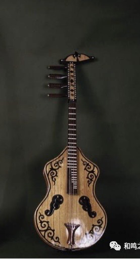
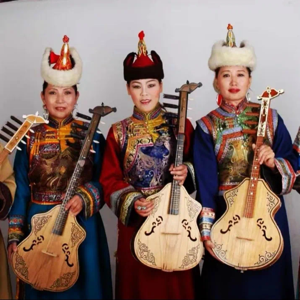
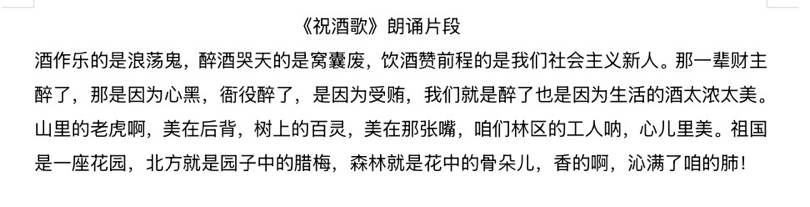
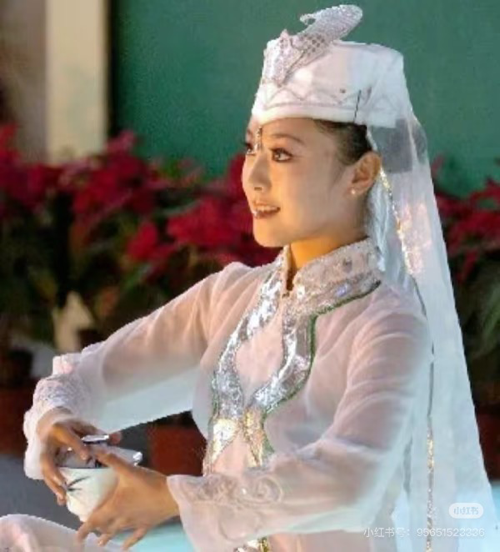

回族（青海） ｜ 火不思

\*视频另附

1 · 乐器——火不思

【火不思】曾译名虎拨思、琥词、琥槌、好比斯、和必斯、胡不思、胡拨等。目前已知（宁胡阏氏传说——即王昭君出塞和亲）出现在公元前1世纪初，是我国古代北方游牧民族共同创制的一种弹弦乐器，大约在20世纪40年代就绝迹于世……

蒙古族新型火不思，是1956年由内蒙古歌舞团青格勒图依据云南省通海县一个蒙古族聚居村落的名叫“苏布达”的乐器创制而成（分大中小三种型号）：张4弦，定弦音高：do sol re la，音域较宽c-c4。琴头长20厘米，装饰为张满弓的箭。演奏时左手按弦，右手持骨拨弹奏，有弹、挑、拂、扫、滚、敲、打等技法；音色清晰、明亮、柔和、圆润，可用于独奏、伴奏、合奏以及弹唱。最常演奏的曲目有：《小黄马》《黄旗阿斯尔》《阿其图》《森吉德玛》及弹唱曲《内蒙好风光》等。

2 · 方言音频 大意

3 · 民族服饰

‌回族服饰是中国回族特有的传统服饰文化，以头饰为显著标志。2006年被列入第一批国家级非物质文化遗产名录。‌其服饰设计融合伊斯兰宗教文化与地域实用需求，男性多戴白色圆帽，女性则以盖头区分年龄阶段，整体风格简洁素雅且兼具功能性。‌‌