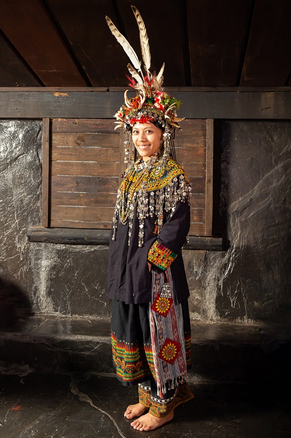

台湾|口鼻笛

1.

**排湾族口鼻笛介绍**

排湾族的双管口笛和鼻笛，是男子用来表达情感、彰显贵族或勇士身份的重要乐器。过去只有头目或贵族男子才能吹奏，笛身常刻有精美纹饰，象征身份和家族荣耀。

**外形结构**

排湾族双管笛，一管有按孔，可吹奏旋律；另一管没有孔，主要发出持续低音，两管一起吹奏，就会形成特殊的复音效果。鼻笛的吹孔设计在笛身上端，需要用鼻息来吹，常见三孔设计。北排湾的Vutsul系统多用圆形吹口、三孔鼻笛；南排湾的Raval地区则常见木塞式斜孔吹口。

**音色风格**

排湾族口鼻笛的音色细腻、柔和，带微微颤音，听起来如泣如诉。族人认为这种颤音可以引发“哀思”（talimuzau），是排湾族独特的音乐风格。双管笛里，有孔的一管像在“说话”，而无孔的一管则像在“配音、陪伴”，与排湾族传统“一人领唱、众人和唱”的多声部唱法相呼应。

**外观装饰**

笛身常刻有传统纹样，如百步蛇、太阳、家族纹等，象征家族血统或社会阶层。雕刻精致，既是乐器，也是身份的象征。

**代表曲目**

排湾族鼻笛的代表曲目之一是《Lalingedan ni vuvu》，旋律如歌如泣，表达对祖先的思念与敬意，是部落文化里非常具有象征意义的乐曲。除此之外还有：

 《思念调》（Talimuzau）

 《勇士之歌》（不同部落旋律不尽相同）

 《情歌调》

**演奏技法**

口笛多用口吹气，通过手指按孔来变换音阶；鼻笛则必须用鼻息轻轻送气。演奏时，气息掌握非常细腻，常带颤音来加强情感的表现。双管同时演奏时，要平衡旋律管和低音管的气息，使复音听起来融合又不混乱。

  
 

2.台湾方言视频大意

大家一起来唱唱歌

大家一起来唱唱歌

大家一起来跳跳舞

大家一起来跳跳舞  
大家一起来玩

大家一起来玩

大家一起来荡秋千

大家一起来荡秋千

3.台湾排湾族民族特色服装与图腾

**一、服饰与等级**

**贵族／头目装扮**

通常以黑底绣红、白、金等鲜艳色彩，刺绣图腾复杂精致，比如**百步蛇纹、人头纹、太阳纹**，象征族群与祖灵的力量与保护身份并且配件华美：大颗**琉璃珠项饰**（古琉璃珠是聘礼与传家宝物，只有贵族才有）

而男性外加鹰羽、兽牙装饰，女性则披华丽珠帘、绣饰肩带。刺绣与串珠常花上半年、甚至一整年。

**平民装扮**

显得朴素，用图案较简单的几何或小范围刺绣，通常以勤劳、生活为主题，即便是平日劳作服，也兼具实用与审美，长摆可擦汗，袖口、衣襟简单装饰，也让人感到温暖与生活气息。

**二、头饰与地位**

**头目/贵族头饰** 更显工细威严，采用红黑绒布为底，饰以**双蛇、兽牙、鹰羽、缨穗**，百步蛇装饰仅限头目使用

**勇士头饰** 则有少许鹰羽与兽牙，显示勇猛。

**未婚少女** 的头饰会加入小铃铛珠串、蝶形图腾，叮叮作响却不浮夸，诉说端庄与希望

 

**三、图腾**

**1.百步蛇** 是排湾族最具代表性的守护神与图腾，它是祖先的化身。贵族服饰上的蛇纹不是简单装饰，而是象征神圣与权力

**2.人头纹** 则代表祖灵守护；**太阳纹** 与人头蛇纹一同诉说天地与生命的对话。

**3.蝴蝶纹** 多见于少女装，象征纯洁与勤奋；鹰羽、兽牙、兽皮等自然素材，彰显与山野的亲近与族群勇气。

