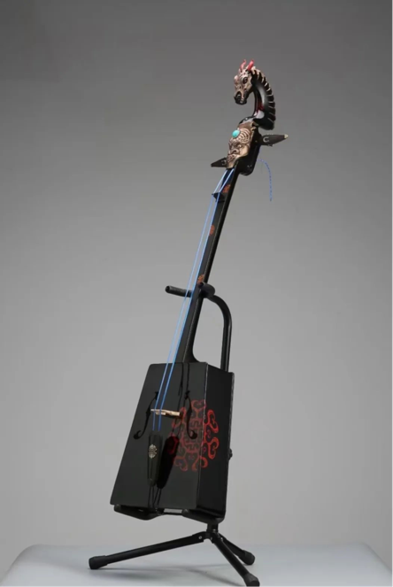
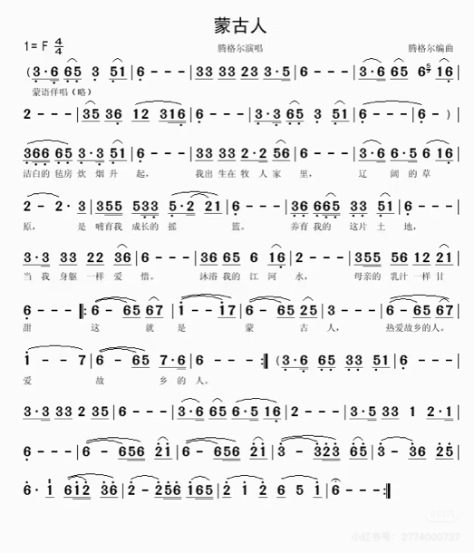
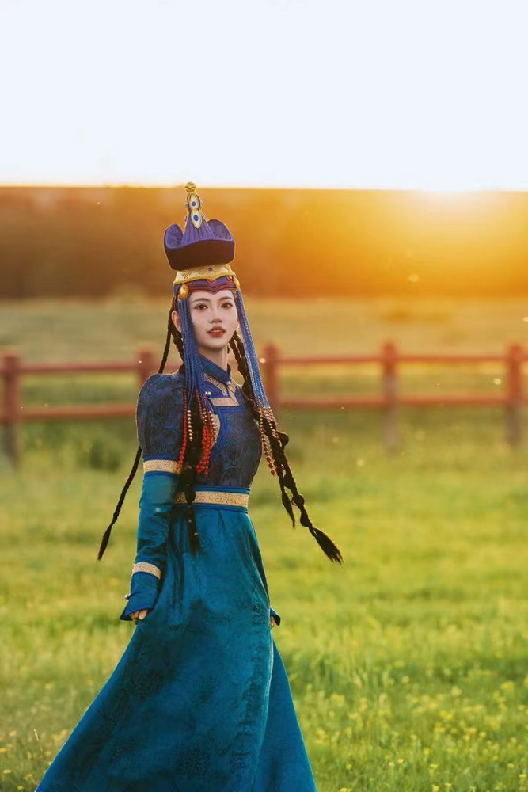

蒙古族（内蒙古）｜马头琴

\*视频另附

1 · 马头琴

马头琴是一种两根弦的弦乐器，蒙古语称“潮尔”。有梯形的琴身和雕刻成马头形状的琴柄。马头琴的共鸣箱呈梯形，声音圆润，低回婉转。

马头琴是适合演奏蒙古族长调最好的乐器，它所演奏的乐曲具有深沉粗犷、激昂的特点，能够形象地描绘出蒙古族同胞的生活场景，如：辽阔的草原、呼啸的狂风、奔腾的马蹄声、欢乐的牧歌等。

2 · 方言大意

3 · 蒙古服饰

蒙古族服饰以长袍（德勒）、腰带（布斯）、靴子及头饰为主体结构，适应草原环境需求。

其特点表现为：‌‌

‌长袍‌：右衽高领、袖长及腕，冬季用皮毛或棉布制成，夏季选用绸缎，具有防风保暖、骑马便利的功能。‌‌

‌腰带‌：用丝绸或皮革制成，男子常挂蒙古刀、火镰等工具，体现实用与威严的双重属性。‌‌

‌头饰与靴子‌：女性头饰镶嵌玛瑙、珊瑚等珠宝，部落差异显著；皮靴采用牛皮或毡制，适应骑马与徒步。

‌‌