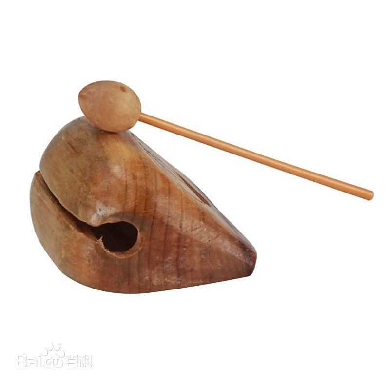
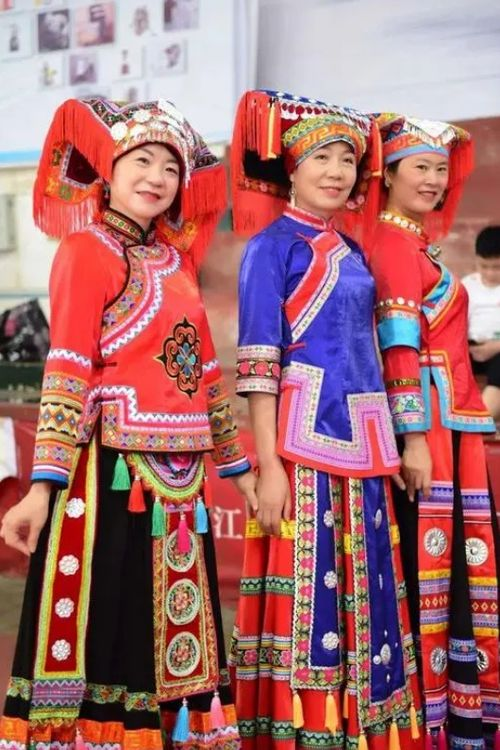

**木鱼**

**木鱼是肇庆佛教寺庙、道教庙观及民间文化中常用的打击乐器，也是肇庆木雕技艺的重要载体。**

*   **地区归属：广东省肇庆市**
*   **乐器类别：体鸣乐器（打击乐器）**
*   **主要用途：**
    *   **佛教诵经**
    *   **道教科仪**
    *   **民间音乐（偶尔在粤曲、木鱼书中出现）**
    *   **民俗仪式（庙会、佛诞等）**

**二、肇庆木鱼的制作工艺**

**肇庆有悠久的木雕传统，这使得肇庆木鱼具有独特的工艺美感：**

**（1）选材讲究**

*   **常用木材：**
    *   **黄花梨**
    *   **紫檀木**
    *   **柚木**
    *   **龙眼木**
*   **木质坚实，音色清脆**

**（2）造型特色**

*   **大多数呈椭圆形或球形**
*   **表面雕刻：**
    *   **鱼鳞纹**
    *   **鱼眼精雕**
    *   **云纹、莲花、佛教吉祥图案**
*   **肇庆木鱼外观雕刻偏向细腻雅致，雕花较浅，注重整体线条流畅感**

**（3）制作工艺**

*   **先将整块木头掏空**
*   **保留外壳厚度均匀，形成共鸣腔**
*   **外部雕刻鱼形**
*   **最后打磨光滑、上漆或涂蜡**

**肇庆木鱼的雕工细致、纹理精美，既是乐器，也是工艺品。**

**三、肇庆木鱼的用途**

**（1）宗教用途**

**佛教**

*   **肇庆古寺众多（如庆云寺、白沙寺）**
*   **木鱼用于：**
    *   **诵经、持咒**
    *   **法事、佛会**
*   **敲击节奏帮助僧众集中精神**

**道教**

*   **肇庆部分道教宫观也使用木鱼**
*   **用于道教科仪的节奏配合**

**（2）民间用途**

*   **在肇庆部分粤曲、木鱼书演出中：**
    *   **木鱼用作节奏伴奏乐器**
    *   **尤其是“木鱼书”演唱中使用**

**四、肇庆木鱼的音色特点**

*   **清脆、明亮**
*   **声音较细，不浑厚**
*   **敲击力度不同，可发出高低不同的声响**
*   **肇庆木鱼音色整体偏柔和，少了北方木鱼那种厚重感**

**这与肇庆文化的温润细腻风格十分契合。**

**五、肇庆木鱼的文化价值**

**肇庆木鱼不仅是佛事法器，也成为肇庆木雕技艺的代表：**

*   **是肇庆传统工艺品的重要组成**
*   **是岭南佛教文化的重要载体**
*   **在民间艺人手中，既是乐器，也是艺术品**

**很多肇庆木鱼还作为工艺品被收藏或作为礼品赠送。**

**总结**

**✅ 肇庆木鱼，是肇庆佛教文化、木雕工艺与岭南民俗融合的产物。它以精美雕工、清脆音色而著称，与佛山、潮汕、北方木鱼相比，展现出肇庆独有的细腻与温润。**

**在肇庆，木鱼不仅是佛寺里的法器，也是一件承载地方文化记忆的艺术珍品。**

2.**肇庆木鱼与其他地区木鱼的差异**

**肇庆木鱼虽然与其他地方的木鱼外形相似，但仍存在细微差别：**

**（1）与佛山木鱼的差异**

**项目**

**肇庆木鱼**

**佛山木鱼**

**雕刻风格**

**线条流畅、雕花较浅**

**雕刻厚重、立体感强**

**图案**

**偏向云纹、莲花等佛教元素**

**佛山常加入狮子、麒麟、龙凤图案**

**音色**

**清脆细腻**

**音色更响亮、力道更足**

**（2）与潮汕木鱼的差异**

**项目**

**肇庆木鱼**

**潮汕木鱼**

**用途**

**多用于佛寺、少量民间曲艺**

**潮汕更侧重民俗乐队（如潮剧、大锣鼓）**

**外观**

**圆润、精雕细刻**

**潮汕木鱼多实用，雕刻较少**

**音色**

**声音柔和**

**潮汕木鱼音色更高亢**

**（3）与北方木鱼的差异**

**项目**

**肇庆木鱼**

**北方木鱼**

**用途**

**佛事、曲艺**

**主要用于佛事**

**造型**

**雕刻精美，工艺感强**

**大多素面、少雕饰**

**音色**

**清脆、细腻**

**声音厚重、低沉**

**3.肇庆方言视频大意**

**《青玉案》**

**（宋·贺铸）**

**飞云冉冉蘅皋暮，  
彩笔新题断肠句。  
试问闲愁都几许？  
一川烟草，  
满城风絮，  
梅子黄时雨。**

**4.肇庆特色服装与图腾**

**一、肇庆特色服装**

肇庆的传统服装，主要受广府文化和少数民族文化共同影响。肇庆既是广府文化区，又是壮族、瑶族、客家等民族聚居地，因此服饰风格丰富多彩。

**（一）广府汉族服饰**

**1\. 广府女性服饰**

*   **唐装上衣 + 阔脚裤**
    *   广府女性传统日常服装
    *   颜色多为淡粉、天蓝、米白
    *   适合岭南湿热气候，轻薄透气
*   **广式旗袍**
    *   肇庆是岭南旗袍流行区域之一
    *   特点：
        *   剪裁合体
        *   图案多为花鸟、牡丹、梅花
        *   色彩柔和
    *   肇庆妇女在婚礼、节庆常穿旗袍

**2\. 广府男性服饰**

*   **唐装**
    *   节庆、庙会或宗祠祭祀常穿
    *   特点：
        *   立领
        *   盘扣
        *   多为深色如藏青、黑、深红
    *   唐装在肇庆有浓郁的地方习俗色彩
*   **黑布衫、阔脚裤**
    *   老一辈肇庆男士的日常装
    *   多用于劳动或宗祠、庙会

**（二）少数民族服饰**

肇庆也是广东少数民族人口较多的地区，尤其是瑶族、壮族，他们的服饰在当地非常有特色。

**1\. 瑶族服饰**

*   主要分布在肇庆北部山区
*   女装特点：
    *   黑色或深蓝色主色调
    *   刺绣花纹丰富，色彩艳丽
    *   银饰装点，如大银项圈、银手镯
*   男装简洁，多穿短衫长裤

**2\. 壮族服饰**

*   分布在封开、德庆等地
*   女装：
    *   蓝靛布染
    *   刺绣腰带
    *   头戴包巾或头帕
*   男装：
    *   多为黑色或深蓝色短衫

**（三）婚礼服饰**

肇庆婚礼融合广府传统：

*   新娘多穿：
    *   龙凤褂
    *   红色旗袍
*   龙凤褂：
    *   红底金线刺绣
    *   龙凤、牡丹图案丰富
*   金箔花：
    *   头饰之一
    *   象征富贵吉祥

**二、肇庆特色图腾**

肇庆的图腾文化，既体现岭南文化，也融合地方特色。图腾主要分布在宗祠灰塑、庙宇雕刻、民间工艺、传统服饰中。

**（一）龙**

*   肇庆宗祠、庙宇最常见图腾
*   象征：
    *   权威
    *   家族兴旺
*   在肇庆龙母庙里，龙文化尤为浓厚

**（二）凤**

*   与龙常成对出现
*   在龙凤褂、婚礼服饰上尤其常见
*   象征：
    *   吉祥
    *   婚姻和谐美满

**（三）牡丹**

*   广泛出现在：
    *   刺绣
    *   木雕
    *   灰塑
*   象征：
    *   富贵
    *   荣华

**（四）麒麟**

*   肇庆宗祠常雕刻麒麟
*   象征：
    *   太平
    *   子嗣昌盛

**（五）狮子**

*   肇庆醒狮文化兴盛
*   狮子图腾用于：
    *   宗祠门楼
    *   庙宇灰塑
*   象征：
    *   镇宅避邪
    *   平安吉祥

**（六）龙母文化**

*   肇庆是**龙母文化发源地**
*   龙母图腾常见于：
    *   庙宇壁画
    *   灰塑雕刻
*   象征：
    *   母爱
    *   庇佑百姓

龙母信仰是肇庆最独特的文化图腾之一。

**（七）莲花**

*   肇庆佛教盛行，莲花图腾极多
*   象征：
    *   清净
    *   吉祥
*   在佛寺雕刻、佛像底座常见