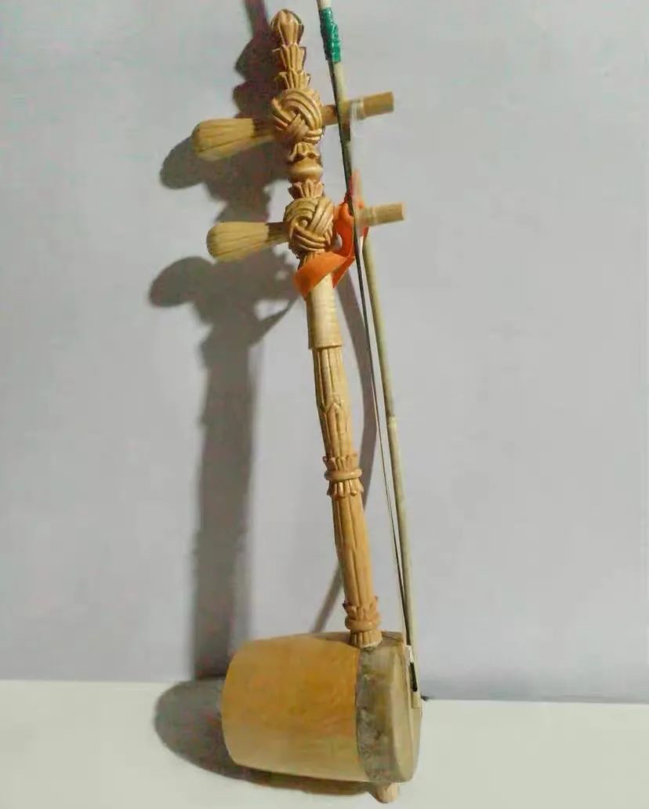
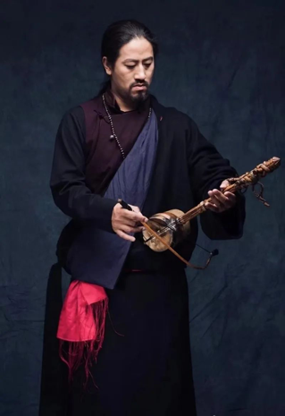
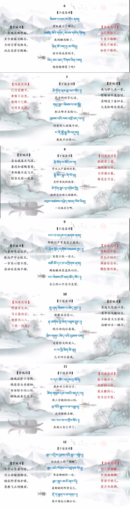
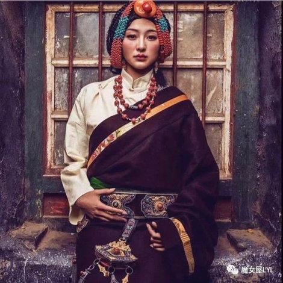
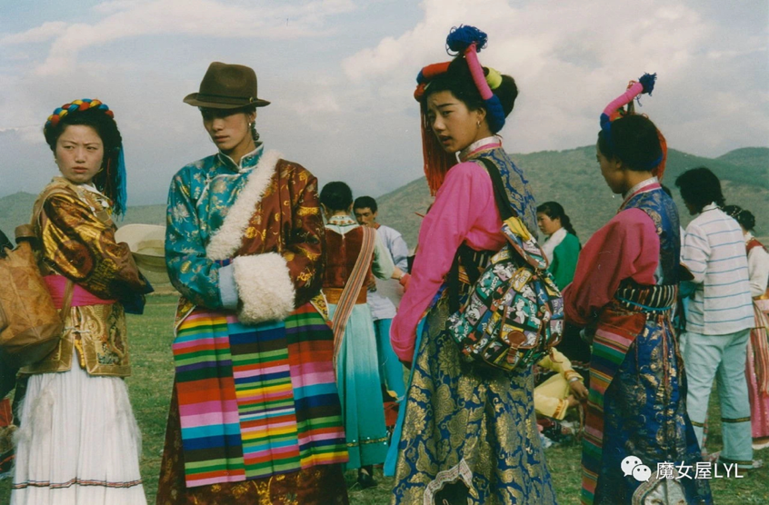
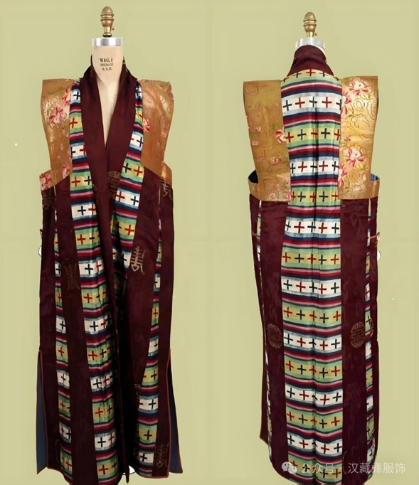
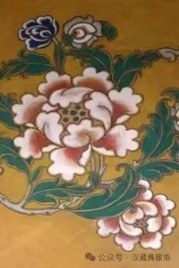
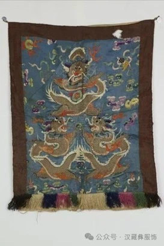
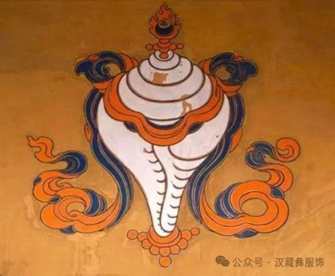

藏族（西藏） ｜ 牛角琴

\*视频资料另附

1 · 乐器——扎尼，藏族弓拉弦鸣乐器。又称牛角琴、牛角胡、马尾胡。历史悠久，形制古老。流行于甘肃省甘南藏族自治州玛曲县和青海省黄南藏族自治州河南县以及藏族半农半牧广大地区。

形制结构琴杆：

木制，呈方柱形，全长70厘米，方宽5厘米，上端的琴头雕刻有民族纹饰，下设一个木制弦轴。琴杆下端较细，插入琴筒并外露系弦。琴筒用粗大的野牛角制成，筒长30厘米左右，角根齐平为筒前口，蒙以牛皮为琴面，面径10厘米～15厘米。弦轴之上张以一束马尾，下面分为两股作为琴弦。琴弓用树枝或木制弓杆，弓毛使用马尾，也分为两股。其中一股夹于两弦之间。青海省藏族聚居的半农半牧地区，流行的扎尼则为名副其实的两弦牛角胡。琴杆、弦轴均为木制，其形与京二胡较为相似。牛角制的琴筒，多要去掉角尖，粗端蒙以羊皮为面。张两束马尾弦，用马尾弓夹于两弦间拉奏。五度关系定弦，发音尖而细，音色清脆悠扬，惟音量较小。可用于独奏或合奏，常用于民间歌舞伴奏。

演奏方法：

演奏时采用坐姿，左手持琴按弦，右手执弓拉奏。这种古老的传统牛角琴，定弦# c2或d2，音域#c2—b2或d2—c3。多平行拉奏，发出双声同音，实际上是一种独弦马尾胡。左手有颤音、滑音、打音、揉弦等技法，右手有连弓、分弓等弓法。较多用于独奏。民间艺人有勒知布、青知布等。

传统乐曲：

传统乐曲有《羁马欲奔》、《天鹅游湖》、《山顶琴声》和《挤奶姑娘》等。传 统 乐 曲传统乐曲有《羁马欲奔》、《天鹅游湖》、《山顶琴声》和《挤奶姑娘》等。

2 · 藏语视频大意

3 · 藏族服饰&图腾

藏服多用皮毛和氆氌制成，非常保暖，十分适合在寒冷的藏区穿。氆氇（pǔlu）是用羊毛家织的毛料，藏族人用它缝制衣裤和藏袍、藏帽、藏靴，这是西藏高原上最普遍、最常见、最有民族特性的面料。

典型的配搭是内穿衬衣、衬裤，外穿藏袍，下身围上邦典（围裙）。

历史：唐书《吐蕃传》上说，公元641年，唐朝文成公主进藏，嫁给藏王松赞干布，第一次见面就使松赞干布感到很难堪，因为文成公主和唐朝送亲官员，公主的男女随员，一个个穿绸着缎，衣饰华丽，轻柔绵软，颜色鲜丽。而松赞干布和他的大臣亲贵们，一律是羊皮袍子，又笨重，又粗糙。也说是这个时候起，松赞干布下决心改变自己的服装，“自褫毡罽袭纨绡，为华风。”他的后妃臣属们也纷纷改装，穿着中原出产的绫罗绸缎，这是吐蕃上层服装方面的一个大变革。

几何纹样以圆形、三角形、方形为基础，通过交错组合形成多角形图案，如“十字纹”和“曼陀罗纹”，象征宇宙的秩序与平衡。

植物纹样受印度和汉地文化影响，常见于服饰和建筑装饰中，如莲花、石榴等，象征生命与繁荣。莲花藏语称“白玛”它有出污泥而不染的品质，至清至纯，被视为开悟烦恼的菩萨德性的象征

动物纹样如龙、凤、狮子等，源自原始信仰，体现了人与自然的和谐关系，同时也寄托了人们对美好生活的向往。

宗教符号如法轮、金刚杵、法螺等，体现了藏传佛教对宇宙观和人生哲理的理解，是藏族文化的重要组成部分。（白海螺藏语称“东嘎 ”，佛经载，释迦牟尼说法时声震四方，如：海螺之音。

