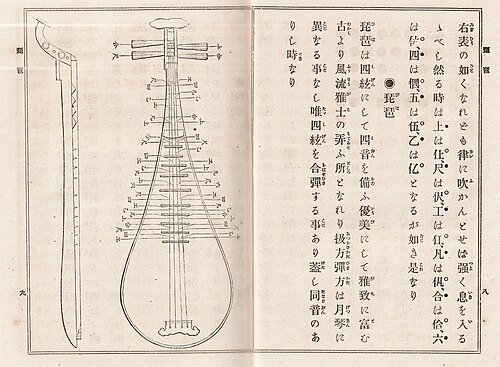

# 🎵 岭南乐器：琵琶

## 📖 乐器简介

琵琶是中国传统弹拨乐器，素有"民乐之王"的美誉。在岭南地区，琵琶演奏技艺独树一帜，融合了北方的刚劲与南方的柔美，形成了独特的岭南风格。

琵琶外形似梨，通常由梧桐木制作，音色清脆明亮，表现力极其丰富。

## 🎼 代表曲目

### 《雨打芭蕉》
这是一首经典的岭南音乐作品，描绘了南国雨景的诗意画面：
- **创作背景**：表现岭南地区雨季时分，雨珠敲打芭蕉叶的自然美景
- **音乐特色**：旋律清新淡雅，节奏轻快活泼
- **艺术意境**：营造出江南水乡的朦胧美感，体现了岭南文化的精致与雅致

## 🎯 演奏技法

### 基础技法
- **弹挑**：右手食指和拇指的基本弹奏方法
- **扫弦**：快速扫过多根弦，营造气势磅礴的效果
- **轮指**：连续快速弹奏，产生如流水般的音效

### 高级技法
- **推拉弦**：通过按弦力度变化产生音高变化
- **泛音**：轻触弦面产生空灵飘逸的音色
- **摇指**：快速颤动产生颤音效果

## 📷 乐器欣赏

*琵琶*

## 🏛️ 历史文化

琵琶在岭南地区的发展可以追溯到唐宋时期，通过海上丝绸之路传入，与当地音乐文化相融合：

### 发展历程
- **唐宋时期**：随商贸传入岭南，开始本土化发展
- **明清时期**：形成独特的岭南琵琶风格
- **现代传承**：成为岭南音乐文化的重要组成部分

### 文化意义
琵琶在岭南不仅是一种乐器，更是文化传承的载体，体现了岭南人民对美好生活的向往和对艺术的追求。

---

💡 **聆听建议**：建议在安静的环境中欣赏琵琶音乐，感受其细腻的音色变化和丰富的情感表达。