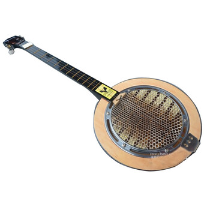
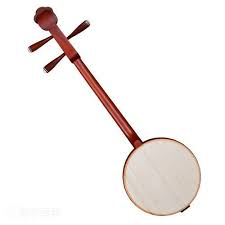
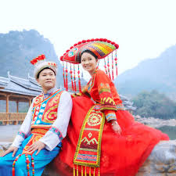
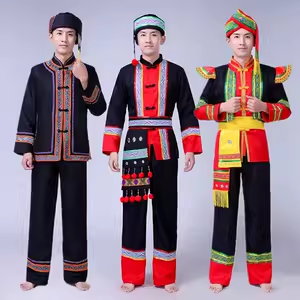
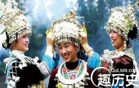
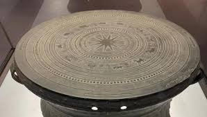
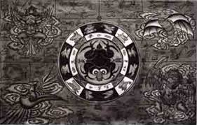

**一、广西壮族秦琴概述**

**秦琴在广西壮族自治区，是一种外来乐器，在民间曲艺和山歌弹唱中偶有使用，但不是广西本土产生的传统乐器。**

*   **原产地**：陕西、甘肃、宁夏等西北地区
*   **流入广西原因**：
    *   清代至民国期间，秦腔剧团、移民将秦琴带入南方
    *   受汉族文化影响，广西部分壮族、汉族艺人开始在民间弹唱中使用秦琴

在广西，秦琴最常见于：

*   壮族山歌对唱
*   民间小调
*   采茶戏、彩调剧等曲艺伴奏

**二、广西秦琴的构造与特色**

**（1）外形**

广西使用的秦琴，与西北地区的传统秦琴大体一致：

*   **琴体**：
    *   扁平长方形或梯形
    *   木质（多用桐木、杉木）
*   **琴颈**：
    *   长而直
    *   上有品格（音位）
*   **弦数**：
    *   多为四弦
    *   部分改良为五弦、六弦
*   **面板**：
    *   厚度较薄，发声清脆
*   **尺寸**：
    *   长度约 60-80 厘米
    *   宽约 10-15 厘米

**（2）音色**

广西秦琴音色：

*   清脆、明亮
*   音量偏小
*   善于表现轻快节奏
*   适合民歌、山歌的伴奏

与西北相比，广西艺人演奏秦琴时：

*   节奏更轻快
*   装饰音较多
*   风格更柔美

**（3）演奏技法**

广西秦琴技法：

*   勾、挑、抹、托
*   快速轮指
*   滑音、揉弦较少
*   节奏感更强
*   用于伴奏时多弹“衬底旋律”

在广西，秦琴多用于独奏短曲或曲艺伴奏，而非西北那样用于大段叙事唱腔。

**三、广西秦琴的用途**

**（1）山歌弹唱**

*   壮族山歌对唱时：
    *   秦琴为歌者伴奏
    *   为即兴对歌提供节奏
*   音色轻快，适合抒发爱情、生活情趣

**（2）曲艺伴奏**

*   广西的采茶戏、彩调剧：
    *   秦琴作为乐队伴奏乐器
*   在地方小调、叙事唱段中：
    *   秦琴负责弹奏节奏骨架

**（3）民间娱乐**

*   民间艺人常抱着秦琴：
    *   弹唱民谣
    *   说唱小故事

 

**四、广西秦琴与其他地区秦琴的差异**

**项目**

**广西秦琴**

**西北秦琴（陕西、甘肃等）**

**用途**

民歌、山歌、采茶戏伴奏

秦腔伴奏、民间说唱

**音色**

清脆轻快，偏细腻

清亮、高亢、音色较厚实

**节奏**

多轻快节奏

节奏较沉稳，适合叙事

**演奏技法**

装饰音丰富，滑音少

多揉弦、滑音、花指

**演奏场合**

小型表演、即兴弹唱

戏曲舞台、曲艺长篇

广西秦琴表现更轻巧、灵动，适合南方风格的民间艺术。

壮族方言视频大意

**壮族民歌《等妈妈》**

妈妈出门去赶圩，  
阿妹在家等妈妈。  
门前种着九节花，  
阿妹望断妈妈归。

妈妈出门去赶圩，  
阿妹在家等妈妈。  
月亮爬上九重天，  
阿妹梦里见妈妈。

**广西壮族民族特色服装与图腾**

**一、广西壮族民族特色服装**

广西壮族是中国人口最多的少数民族之一，其服饰极具地方风格。

**（1）壮族男装**

*   颜色多为黑色或蓝色
*   对襟短衫
*   下身为长裤
*   腰系布带
*   布料：
    *   多为棉布或靛蓝布
*   功能：
    *   轻便适合劳作

**（2）壮族女装**

*   颜色以黑、蓝为主
*   特点：
    *   领口、袖口多刺绣彩边
    *   喜用银饰装点，如耳环、胸饰
*   裙装或长裤
*   节庆服装：
    *   银饰更丰富
    *   衣饰多绣花纹

**（3）银饰**

壮族女性服饰里：

*   银项圈
*   银胸牌
*   银铃饰

象征：

*   富贵
*   镇邪驱凶

 

 

**二、广西壮族民族特色图腾**

壮族有非常独特的图腾文化。

**（1）铜鼓**

*   广西壮族最具代表性的民族图腾
*   寓意：
    *   权力
    *   丰收
    *   团结
*   铜鼓上常雕：
    *   青蛙
    *   太阳
    *   舞蹈人群
*   铜鼓不仅是乐器，也是图腾与权力象征

**（2）青蛙**

*   壮族重要图腾
*   寓意：
    *   生育繁衍
    *   雨水丰足
*   铜鼓中心常刻青蛙纹

**（3）龙**

*   壮族、瑶族均崇龙
*   象征：
    *   尊贵
    *   吉祥
*   出现在刺绣、庙宇装饰中

**（4）太阳纹**

*   壮族铜鼓常雕太阳纹
*   寓意：
    *   光明
    *   希望
*   也是祭祀的重要象征

