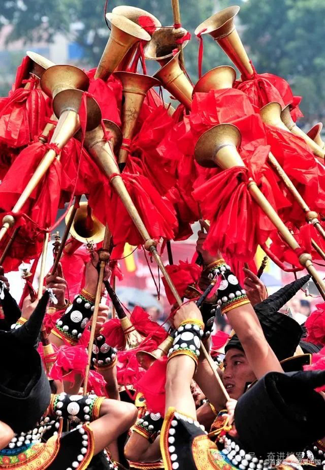
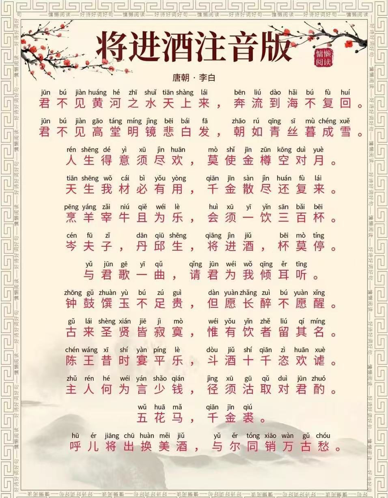
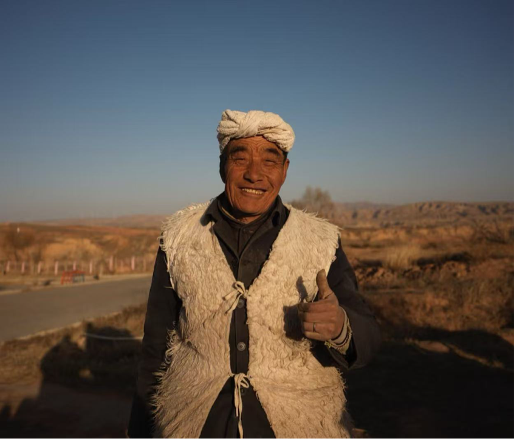
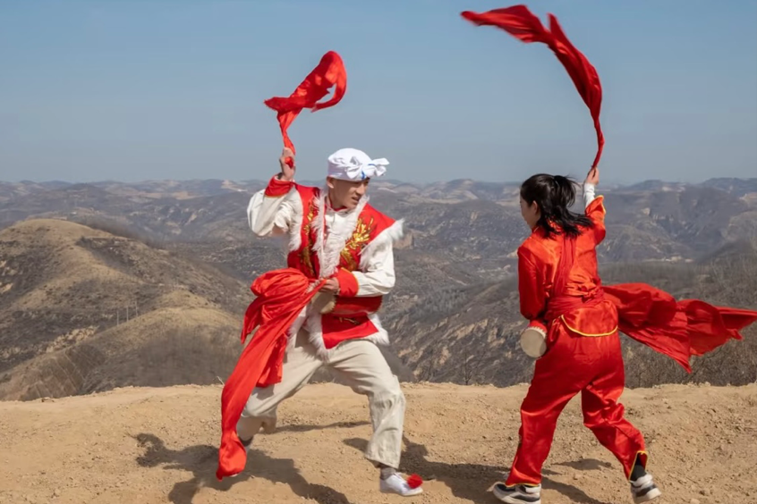

汉族（陕西）｜ 唢呐

1 · 唢呐

陕北唢呐，又叫大唢呐。杆长公分，碗子长公分，揍子长公分。哨子是用竿子制成，发音洪大，高亢明亮，哨子小，加上用循环换气法吹奏，使吐音清晰巧致连绵不断。它正面七孔、背面一孔。七孔比筒间离八度，超吹可高出十六度。陕北唢呐吹打乐属鼓吹乐类。乐队结构是两支唢呐上手、下手三件打击乐小鼓、小钗、乳锣。红白喜事加一支长号它是色彩乐器，仅在起落、转板时吹长音。演奏形式有两种一为座场吹打二为行路吹打。以较为复杂的座场吹打为例，基本板式是慢板一板三眼—流板一板一眼—垛板一板一眼—甲板一板一眼特快大致都是慢起—渐快—快—特快结束。

2 · 方言视频大意

3 · 陕西服饰

汉服中的陕西服饰具有显著的地域差异，分为陕北、关中和陕南三大区域，风格迥异‌：陕北服饰以羊毛皮料为主，注重实用保暖；关中服饰保留汉族传统，以棉布材质和素净色彩为特色；陕南服饰则受楚蜀文化影响，色彩艳丽且兼具南北风情。

