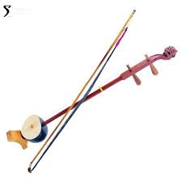
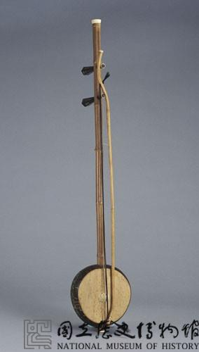
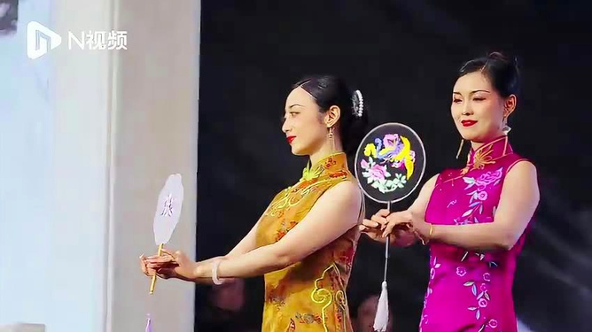
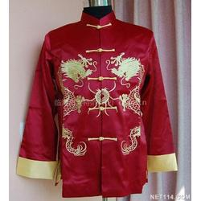

**岭南地区—江门 | 椰胡**

1

.

**一、椰胡的定义与归属**

**椰胡**，是一种岭南地区极具地方特色的拉弦乐器，属于二胡家族。

*   **类属**：弓弦乐器（二胡类）
*   **主要流行地**：岭南地区（广东、广西、海南）
*   **在岭南最具代表性的地区**：
    *   珠江三角洲，包括广州市、佛山市、中山市、江门市
    *   粤西及海南沿海一带
*   **主要用途**：
    *   广东音乐（粤乐）伴奏
    *   民间歌舞
    *   少数民族歌舞
    *   独奏、合奏

**椰胡尤其是广东珠三角、尤其江门地区的代表性乐器。**

**二、椰胡的起源与历史**

椰胡的历史可以追溯到清代：

*   源自岭南地区的二弦胡琴
*   因琴筒采用椰壳制成而得名“椰胡”
*   在清末民初逐渐进入粤乐体系，成为广东音乐必不可少的乐器
*   江门、顺德、中山等地的艺人都曾改良椰胡工艺，使椰胡音色更加明亮、灵巧

**三、椰胡的外形与结构**

椰胡形制与普通二胡类似，但外观及材料充满岭南特色：

**1\. 琴筒（共鸣箱）**

*   用椰子壳制作
*   外观椭圆或半球形
*   外表抛光光亮，有的雕刻花纹或彩绘
*   面蒙蛇皮或鲨鱼皮
*   江门地区尤其擅长雕刻精美的装饰

**2\. 琴杆**

*   多用红木、紫檀、黄花梨
*   江门椰胡琴杆做工精细，通常更轻便

**3\. 弦**

*   两根弦
*   现代多为钢丝弦

**4\. 弓**

*   马尾弓
*   弓毛夹在两弦之间

**四、江门地区椰胡的特色**

江门市（特别是台山市、新会区）是岭南椰胡的重要产地和流行区，椰胡在江门不仅是乐器，更是一种地方文化象征。

**1\. 江门椰胡的制作**

*   江门盛产椰壳，制作原料丰富
*   江门艺人擅长雕刻工艺：
    *   在椰壳外雕刻花卉、龙凤、喜鹊等吉祥图案
    *   有些高档椰胡甚至镶嵌贝壳、镀金
*   江门制琴师讲究音色调试：
    *   琴筒薄而坚
    *   音色更透亮
    *   张力更均匀

**2\. 江门椰胡的音色**

江门产的椰胡，音色非常鲜明：

*   清脆中带甜润
*   音色柔和而不失穿透力
*   非常适合演奏快板、花腔旋律

**3\. 江门椰胡的用途**

*   粤乐演奏：
    *   江门的粤乐团体常用椰胡
*   民间节庆：
    *   江门许多乡村婚礼、节庆常有椰胡演奏
*   海外侨乡：
    *   江门侨乡文化把椰胡带到世界各地

江门椰胡可谓“粤乐灵魂”的象征之一。

**五、演奏技法**

椰胡的演奏与二胡类似，但更讲究灵巧：

**运弓**

*   弓夹两弦之间
*   可独奏内弦或外弦

**左手技法**

*   滑音
*   花指
*   颤音

**音色表现**

*   擅演快速跑句
*   装饰音丰富

**六、椰胡在代表曲目中的应用**

许多广东音乐名曲，都少不了椰胡：

*   《步步高》
*   《娱乐升平》
*   《彩云追月》
*   《平湖秋月》

江门椰胡以音色清脆、灵动，尤其擅长演奏这些曲目中的快速花腔部分。

**总结**

椰胡是岭南地区非常有特色的乐器，尤其在**江门地区**最具代表性。江门椰胡以精美的制作、灵巧的音色和浓郁的地方特色，成为广东音乐乃至岭南文化中不可或缺的珍宝。而在广州、佛山、海南等地，椰胡同样各具风采，共同构成了岭南音乐绚丽多彩的画卷。

 

**2.其他地区椰胡的发展**

**广州**

*   是粤乐发展最繁盛的城市
*   椰胡用于粤剧伴奏、粤乐独奏
*   广州制作的椰胡外观简洁大方，注重音色均衡

**佛山、顺德、中山**

*   椰胡制作工艺精细
*   佛山部分椰胡制作者注重雕刻艺术，琴体花纹细腻

**海南**

*   海南黎族也使用椰胡
*   海南椰胡有时结构更简化
*   民间多用于黎族山歌、舞蹈伴奏

**3.江门方言视频大意**

**《和端午》**

（宋·张耒）

竞渡深悲千载冤，  
忠魂一去讵能还？  
国亡身殒今何有？  
只留离骚在世间。

**4.江门特色服装与图腾**

**一、江门特色服装**

江门位于珠江三角洲西部，是著名的侨乡。江门地区的传统服饰受岭南文化影响，又融合侨乡文化特色。

**（一）女性服饰**

**1\. 广式旗袍**

*   江门是珠三角的重要旗袍流行区。
*   **风格**：
    *   剪裁贴身
    *   线条流畅
    *   善用花色布料，尤其是花鸟、龙凤等吉祥纹样
*   在江门，很多妇女在婚礼、节庆或宴席上仍会选择穿旗袍，尤其是中山、新会地区。

**2\. 丝绸衫裤**

*   江门女性传统日常服饰之一。
*   **特点**：
    *   多为素雅色彩，如淡粉、天蓝、米白
    *   面料轻薄透气，适应岭南湿热气候
*   新会、鹤山等地的传统女性，曾以丝绸短衫、长裤搭配布鞋为常见装扮。

**3\. 婚礼凤冠霞帔**

*   江门部分地区仍保留传统中式婚礼服。
*   **凤冠霞帔**：
    *   凤凰、牡丹、龙等刺绣
    *   红色、金线为主色
    *   装饰繁复、象征吉祥

**（二）男性服饰**

**1\.** **唐装**

*   唐装在江门非常流行，尤其在节庆或侨胞返乡时穿着。
*   **特点**：
    *   立领、盘扣
    *   面料多为绸缎或棉布
    *   多用红、蓝、黑等传统色

**2\. 黑布衫、阔脚裤**

*   江门老一辈男性日常服饰。
*   颜色多为黑、蓝、灰，简单耐穿。
*   多在劳作、拜神、节庆时穿用。

**（三）特色头饰**

江门部分农村妇女，尤其在新会、台山、开平，仍留有：

*   **绣花头巾**
*   **银饰发簪**
*   **金箔花**  
    用于婚礼或节庆时装扮。

**二、江门特色图腾**

江门作为岭南侨乡，拥有浓厚的宗族文化和地域特色，许多图腾在江门的建筑、服饰、民俗中频繁出现。

**（一）龙凤**

*   在江门的婚礼服、宗祠、庙宇雕刻中极为常见。
*   **龙**：象征权威、尊贵、家族兴旺。
*   **凤**：象征吉祥、和谐美满，尤其用于婚礼场合。

**（二）牡丹**

*   江门刺绣、旗袍、传统建筑中常见图案。
*   象征富贵、繁荣、幸福。

**（三）****麒麟**

*   麒麟在江门宗祠、庙宇装饰中非常常见。
*   **寓意**：
    *   太平吉祥
    *   子嗣繁盛
*   在江门的舞麒麟活动中，也是重要民俗。

**（四）狮子**

*   江门是南狮的重要流行地，台山、开平尤甚。
*   南狮（醒狮）图案常见于：
    *   庙宇装饰
    *   宗祠门楼
    *   喜庆刺绣
*   象征驱邪避凶、吉祥如意。

**（五）石榴**

*   在江门婚礼刺绣、家具雕刻中经常出现。
*   象征多子多福。

**（六）船与洋楼图案**

江门作为著名侨乡，有独特的侨乡图腾：

*   **帆船**：
    *   象征侨民出洋谋生、顺风顺水。
*   **洋楼**：
    *   象征侨民富贵归乡、家族荣耀。
*   在江门的彩瓷、灰塑、年画里常见。

**江门特色图腾的应用**

江门的这些图腾，广泛出现在：

*   宗祠灰塑
*   庙宇壁画
*   民间刺绣
*   婚礼服饰
*   家具雕刻
*   侨乡纪念品

它们不仅是装饰，更蕴含家族祈福、风水信仰、文化传承。

**总结**

江门的服装与图腾，是岭南文化与侨乡文化交融的产物。服饰方面，江门保留了岭南丝绸服、旗袍、唐装的传统，又融入侨乡审美；而图腾方面，龙凤、麒麟、狮子等传统吉祥物与侨乡特色的帆船、洋楼，共同构成了江门丰富多彩的文化符号，展现出江门人民对幸福、吉祥、家族兴旺的美好向往。