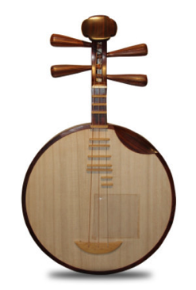
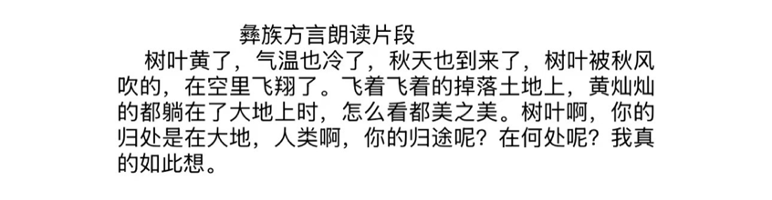
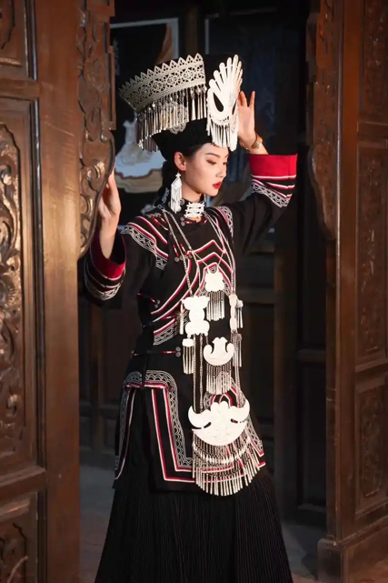

彝族（贵州）｜月琴

\*视频另附

1 · 月琴

月琴是彝族主要的弹拨乐器。因其形圆似月、声如琴，而得月琴之名。月琴彝语称“弦子”“库竹”或“四弦”，又称“腔资”“杰猜”等，是彝族历史悠久的传统乐器。

2 · 方言视频大意

3 · 民族服饰

彝族服饰装饰体系兼具美学价值与文化符号功能：

‌刺绣工艺‌：使用平绣、镶补技法，纹样涵盖天象（日月星辰）、动植物（羊角、火镰）等自然元素，围腰刺绣最为繁复。‌‌‌‌

‌银饰体系‌：领口银排花、耳坠、银泡镶嵌普遍应用，节庆盛装银饰可达上千组件，体现财富与社会地位。‌‌

‌边缘处理‌：衣襟、袖口采用红黄绿多色镶边，凉山型服饰常在察尔瓦边缘添加红黄牙边与绳穗。‌‌‌‌

