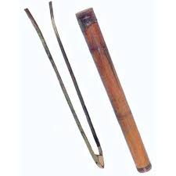
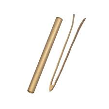
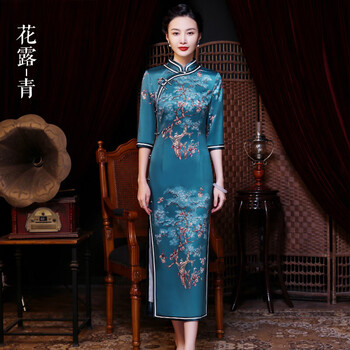
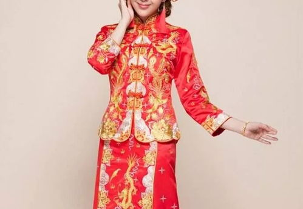

**一、佛山渔鼓概述**

 **渔鼓在佛山，是佛山民间曲艺与粤韵说唱的重要伴奏乐器。**

*   属于体鸣打击乐器
*   在佛山，渔鼓常见于：
    *   木鱼书
    *   佛山评书
    *   粤韵说唱
    *   庙会、节庆演出

佛山是岭南曲艺重镇，渔鼓与木鱼一起，构成了佛山说唱艺术的灵魂节奏。

**二、佛山渔鼓的构造与特色**

**（1）材质**

*   佛山渔鼓多选：
    *   优质硬木（如黄花梨、紫檀）
    *   竹材
*   筒身雕刻精美
*   佛山木雕工艺发达，渔鼓常饰雕花纹：
    *   龙凤
    *   花卉
    *   吉祥纹

**（2）外形**

*   筒状，中空
*   长约 30～50 cm
*   直径约 5～10 cm
*   两端多留空，也有封闭蒙皮的款式

佛山的渔鼓外观更加讲究工艺美感，是一件兼具乐器与艺术品的器物。

**（3）演奏方式**

*   一手持鼓棒
*   一手握住筒身
*   鼓棒敲击筒身或鼓面
*   发出“咚、咚”或“咚咚咚”的节奏声
*   在木鱼书里：
    *   渔鼓常与木鱼交替敲击
    *   营造节奏感和气氛

**（4）音色**

*   佛山渔鼓音色：
    *   清脆
    *   节奏明快
*   节奏模式：
    *   单击
    *   双击
    *   花击（快速多点打击）

佛山艺人会根据说书内容调整渔鼓的节奏，比如：

*   讲悲情段落 → 慢敲
*   讲热闹场面 → 快敲、花敲

**三、佛山渔鼓的用途**

**（1）木鱼书**

佛山是“木鱼书”的重要流行地：

*   木鱼书：
    *   一种粤语说唱艺术
    *   艺人手敲木鱼与渔鼓
    *   一边说唱故事
*   渔鼓在木鱼书里：
    *   负责节奏控制
    *   增强表演感染力

**（2）佛山评书**

佛山评书不同于北方评书：

*   节奏更快
*   声音更灵活
*   渔鼓打节奏是佛山评书的重要标志

**（3）庙会与节庆**

*   佛山民间庙会：
    *   渔鼓用于即兴说唱
    *   增添热闹氛围

**四、佛山渔鼓与其他地区渔鼓的差异**

佛山渔鼓与其他地区渔鼓在以下方面有显著不同：

**地区**

**渔鼓特色**

**佛山（珠三角）**

制作工艺精美，雕刻花纹多；常与木鱼搭配使用，节奏轻快灵巧

**湖南、湖北**

渔鼓用于花鼓戏、地方戏伴奏，筒体更粗大，音色低沉

**河南、山西**

渔鼓多用于快板书、坠子书，节奏更短促密集

**江浙**

渔鼓用于评弹，道情中，音色偏柔和

**佛山方言视频大意**

**《垓下歌》**

力拔山兮气盖世，  
时不利兮骓不逝。  
骓不逝兮可奈何？  
虞兮虞兮奈若何！

**佛山特色服装与图腾**

**一、佛山特色服装**

佛山作为广府文化核心地，其服饰既保留传统，又融合现代审美。

**（1）广府男性服饰**

*   唐装最具代表性：
    *   立领、盘扣
    *   多为深蓝、藏青、黑色
    *   用料多选丝绸、棉布
*   黑布衫、宽脚裤：
    *   老一辈日常穿着
    *   简洁实用

**（2）广府女性服饰**

*   广式旗袍：
    *   佛山是岭南旗袍流行的重要地区
    *   特点：
        *   剪裁合体
        *   刺绣花边
        *   轻盈飘逸
*   日常服饰：
    *   丝绸上衣
    *   阔腿裤

**（3）佛山婚礼服饰**

佛山婚礼保留传统：

*   新娘穿：
    *   龙凤褂
        *   红底金线
        *   龙凤、牡丹刺绣
*   头戴金箔花：
    *   象征富贵吉祥

**二、佛山特色图腾**

佛山是岭南灰塑、陶艺的重镇，许多图腾在建筑、服饰、民间工艺中广泛存在。

**（1）狮子**

*   佛山是南狮（醒狮）的发源地之一
*   狮子图腾用于：
    *   庙宇灰塑
    *   宗祠门楼
    *   节庆舞狮
*   象征：
    *   驱邪避凶
    *   镇宅平安

**（2）龙**

*   在宗祠、庙宇装饰极为常见
*   象征：
    *   尊贵
    *   权力
    *   兴旺

**（3）牡丹**

*   佛山刺绣、陶塑常用
*   寓意：
    *   富贵
    *   荣华

**（4）麒麟**

*   佛山灰塑里常见麒麟
*   寓意：
    *   太平
    *   子嗣昌盛

**（5）莲花**

*   佛山宗教文化浓厚
*   莲花图腾象征：
    *   清净
    *   吉祥