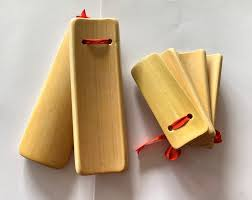

**一、广州竹板**

**竹板在广州，是广府曲艺文化中极具代表性的节奏打击乐器。**

*   属于体鸣打击乐器
*   广州是岭南曲艺中心，竹板在广州常用于：
    *   粤韵说唱
    *   木鱼书
    *   广州快板
    *   庙会、节庆民俗表演

广州的竹板不仅是乐器，更是广府文化的重要象征。

**二、广州竹板的构造与特色**

**（1）材质**

*   广州竹板多用：
    *   老竹
    *   紫竹
    *   硬质青竹
*   竹质坚韧，敲击声清脆

**（2）外形**

*   长约 15～25 cm
*   宽约 3～5 cm
*   厚约 0.5～1 cm
*   有两种类型：
    *   **串连竹板**：几片竹片用绳串在一起
    *   **单片竹板**：单独拍打

**（3）装饰**

广州是工艺之都，竹板也常被雕刻精美：

*   刻花纹：
    *   龙凤
    *   花卉
    *   吉祥图案
*   部分竹板还会上漆或描金

**（4）音色**

*   清脆、响亮
*   节奏灵巧
*   非常适合粤语快节奏的语言韵律

**（5）演奏方式**

广州艺人演奏竹板：

*   单手或双手持竹板
*   节奏模式：
    *   单击
    *   双击
    *   滚击（连续快速拍击）
*   多用于：
    *   说唱伴奏
    *   渲染情绪
    *   转场衔接

**三、广州竹板的用途**

**（1）粤韵说唱**

*   广州竹板是粤韵说唱不可缺少的节奏工具：
    *   艺人边拍竹板，边唱故事或说白
*   节奏配合粤语短促声调，极富表现力

**（2）木鱼书**

*   广州木鱼书：
    *   粤语说唱艺术
    *   渔鼓与竹板共同伴奏
*   艺人：
    *   用竹板敲击节奏
    *   一边讲述民间故事

**（3）广州快板**

*   类似北方快板书
*   节奏更轻快
*   广州快板融合：
    *   木鱼书节奏
    *   广府幽默语言
*   竹板是表演必备

**（4）节庆庙会**

*   广州庙会、祠堂节庆：
    *   民间艺人用竹板说唱吉祥话
    *   热闹气氛中常能听到竹板声

**四、广州竹板与其他地区竹板的差异**

广州竹板与北方或其他地区竹板有明显差别：

**特征**

**广州竹板**

**北方竹板（快板）**

**材质**

多用硬竹、竹质细密

多用硬木、竹片更厚

**重量**

较轻巧

略沉

**节奏**

轻快灵活，节奏短促

力度大，节奏更厚重

**音色**

清脆、尖亮

浑厚、响亮

**表演语言**

粤语，节奏更碎

普通话或方言，节奏均匀

**风格**

常与粤剧、木鱼书结合

多单独表演或配合北方曲艺